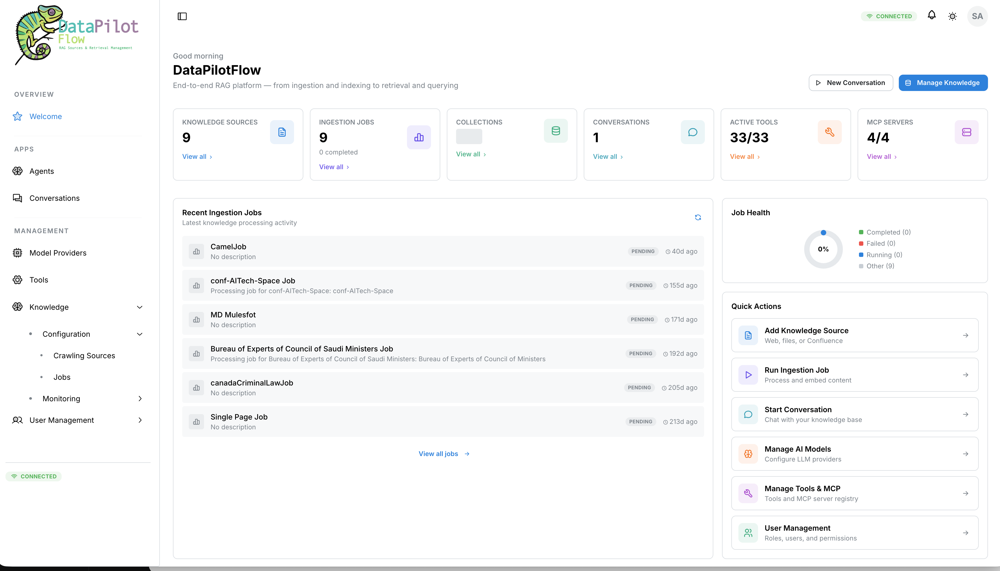
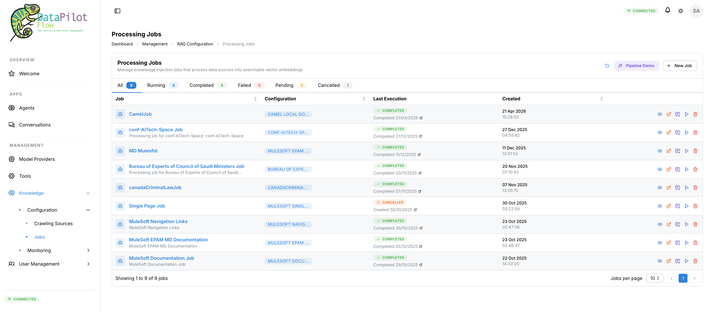
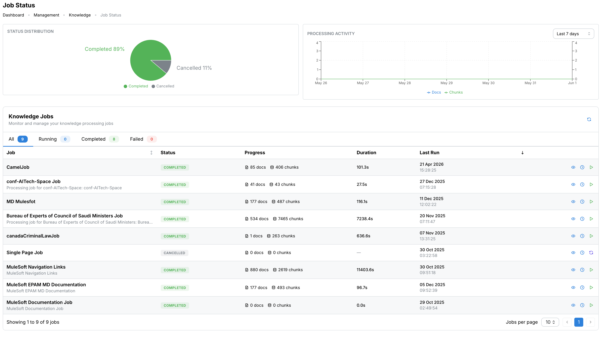
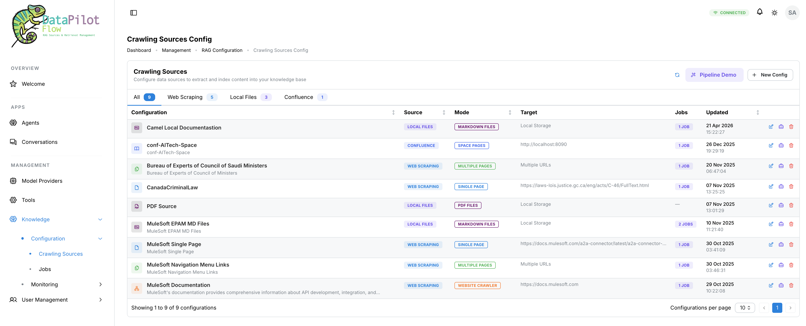
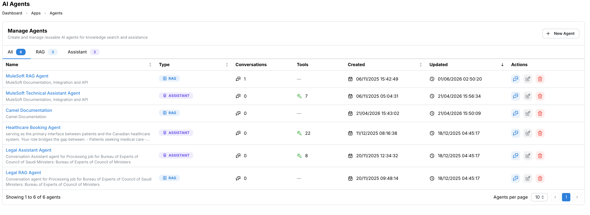
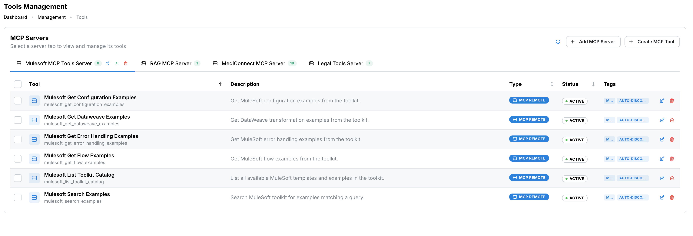
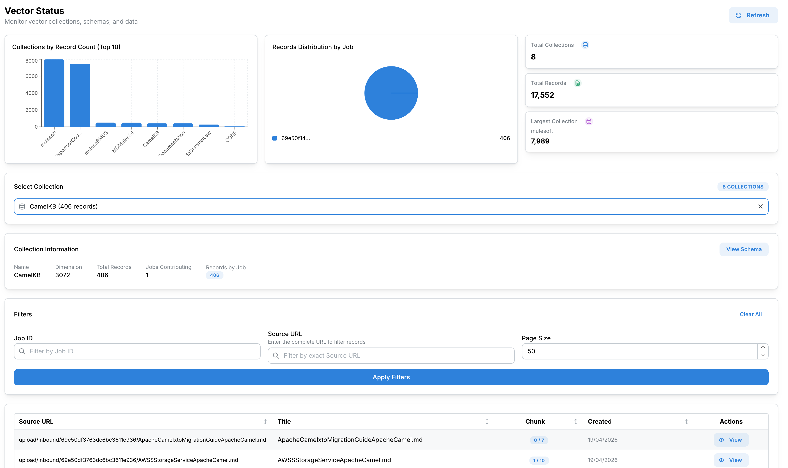
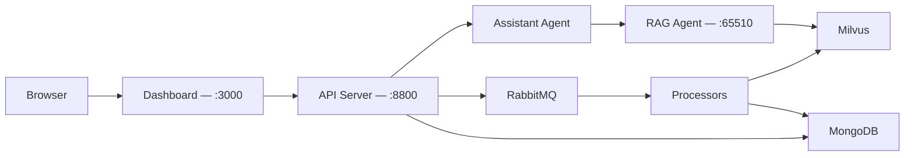
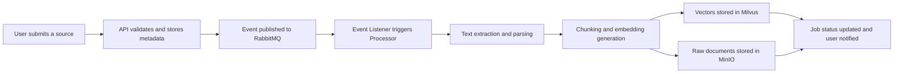
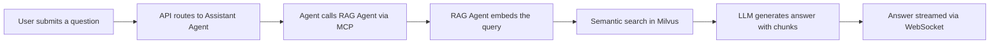

# DataPilotFlow

**Intelligent Enterprise Knowledge Platform — RAG Sources and Retrieval Management**

DataPilotFlow is an open, event-driven platform for building and querying enterprise knowledge bases powered by Retrieval-Augmented Generation (RAG). It automates the full pipeline from document ingestion to intelligent, source-cited conversational answers — deployable in minutes with a single Docker Compose command.



---

## Table of Contents

- [Overview](#overview)
- [Key Features](#key-features)
- [Screenshots](#screenshots)
- [Architecture](#architecture)
- [Project Structure](#project-structure)
- [Quick Start](#quick-start)
- [Configuration](#configuration)
- [Module Documentation](#module-documentation)
- [License](#license)

---

## Overview

DataPilotFlow turns your documents, websites, and third-party knowledge sources into a queryable intelligence layer. Users upload files or configure crawling sources, the platform processes and indexes them asynchronously into a vector database, and a multi-agent AI system answers natural language questions with full source attribution — streamed in real time over WebSocket.

The system is built as a set of loosely coupled Python microservices backed by a React dashboard, connected through an event-driven message bus. Every component is containerized and production-ready.

**In practice**: configure a source, run an ingestion job, open a conversation, and ask questions. The platform handles extraction, chunking, embedding, retrieval, and generation.

---

## Key Features

- **Multi-Agent Orchestration** — A supervisor agent coordinates a RAG agent, tool calls, and external MCP servers using LangGraph
- **Event-Driven Processing** — Document ingestion runs asynchronously via RabbitMQ; jobs are non-blocking and resumable
- **Multiple Source Types** — Ingest from local files (PDF, Markdown, text), web crawling (single page, multi-page, website), and Confluence spaces
- **Vector Search** — Milvus stores and queries high-dimensional embeddings for semantic similarity retrieval
- **MCP Server Exposure** — The RAG agent exposes its retrieval capabilities as a Model Context Protocol server for external agent integration
- **Real-Time Streaming** — Answers stream to the browser via WebSocket; job progress updates in real time
- **Tool Registry** — Connect and manage remote MCP tool servers; agents discover and invoke tools dynamically
- **Role-Based Access Control** — Five system roles (Platform Admin, RAG Engineer, Knowledge Manager, AI User, Viewer) with granular permissions and JWT authentication
- **Production Docker Deployment** — Nine containerized services with health checks, dependency ordering, and persistent data volumes

---

## Screenshots

### Dashboard

The home screen provides a live overview of knowledge sources, ingestion jobs, active conversations, registered tools, and MCP servers. Quick actions surface the most common workflows.


---

### Processing Jobs

Knowledge injection jobs process data sources into searchable vector embeddings. Each job tracks its configuration, execution status, and completion timestamp.



---

### Job Status and Monitoring

The job status view shows status distribution across all jobs, a processing activity timeline, and per-job progress metrics including document and chunk counts.



---

### Crawling Sources

Configure data sources for extraction and indexing. Supports web scraping (single page, multiple pages, full website crawler), local file paths, and Confluence space imports.



---

### AI Agents

Create and manage reusable AI agents. RAG agents handle document retrieval; Assistant agents act as supervisors that orchestrate tools, RAG lookups, and multi-turn reasoning.



---

### Tools and MCP Servers

Register remote MCP servers and manage their exposed tools. Agents discover and invoke tools from any connected server at runtime.



---

### Vector Status

Inspect vector collections stored in Milvus — record counts, dimension sizes, job contributions, and individual chunk records with their source URLs.



---

## Architecture

### High-Level System Diagram



### Knowledge Ingestion Pipeline



### Query and Response Pipeline



---

## Project Structure

```
datapilotflow/
├── datapilotflow-domain/          # Core domain models (Pydantic), configuration, validation
├── datapilotflow-infrastructure/  # DAOs, MongoDB/Milvus/RabbitMQ/MinIO clients
├── datapilotflow-services/        # Business logic: Knowledge, Auth, Notifications, Tools
├── datapilotflow-api/             # FastAPI REST server + WebSocket — Port 8800
├── datapilotflow-rag-agent/       # RAG agent with MCP server exposure — Port 65510
├── datapilotflow-assistant-agent/ # Supervisor agent, multi-turn conversations
├── datapilotflow-events/          # RabbitMQ event publishers and listeners
├── datapilotflow-processors/      # Text extraction, chunking, embedding, web crawling
├── datapilotflow-dashboard/       # React + Vite + Mantine UI frontend — Port 3000
└── docker/                        # docker-compose.yml and Dockerfiles
```

### Module Responsibilities

| Module | Role | Key Dependencies |
|--------|------|-----------------|
| `datapilotflow-domain` | Foundation — models and config | Pydantic only |
| `datapilotflow-infrastructure` | Data access layer | domain |
| `datapilotflow-services` | Business logic and orchestration | domain, infrastructure |
| `datapilotflow-api` | HTTP/WebSocket interface | all modules |
| `datapilotflow-rag-agent` | Semantic retrieval + MCP server | domain, infrastructure, services |
| `datapilotflow-assistant-agent` | Supervisor agent + tool routing | domain, infrastructure, services |
| `datapilotflow-events` | Async messaging via RabbitMQ | domain, infrastructure |
| `datapilotflow-processors` | Document ingestion pipeline | domain, infrastructure, services |
| `datapilotflow-dashboard` | Web UI | API over HTTP/WebSocket |

---

## Quick Start

**Requirements**: Docker, Docker Compose, 10 GB free disk space, a modern browser.

### Option 1 — Pre-built images (no clone, no build)

Multi-arch (amd64/arm64) images are published to GHCR on every release.

```bash
curl -O https://raw.githubusercontent.com/bassem-elsodany/datapilotflow/main/docker/docker-compose.ghcr.yml
docker-compose -f docker-compose.ghcr.yml up -d
docker-compose -f docker-compose.ghcr.yml ps
```

Deploying to a remote server rather than running locally? Point the dashboard at your server's address:
`API_BASE_URL=http://your-server:8800 docker-compose -f docker-compose.ghcr.yml up -d`

### Option 2 — Build from source

```bash
git clone https://github.com/bassem-elsodany/datapilotflow.git
cd datapilotflow

cd docker
docker-compose up -d
docker-compose ps
```

Once healthy, open [http://localhost:3000](http://localhost:3000).

### Service Access Points

| Service | URL | Description |
|---------|-----|-------------|
| Dashboard | http://localhost:3000 | Web UI |
| REST API | http://localhost:8800 | API server |
| API Docs | http://localhost:8800/docs | Swagger / OpenAPI |
| RabbitMQ Console | http://localhost:15675 | Message broker management |
| Milvus | http://localhost:19530 | Vector database |

### First Steps After Deployment

A default admin account is created automatically on first startup:

| Field | Value |
|-------|-------|
| Username | `admin` |
| Password | `admin123` |
| Email | `admin@datapilotflow.com` |
| Role | Platform Admin |

Change the password immediately after first login via **User Management > My Profile**.

1. Open [http://localhost:3000](http://localhost:3000) and log in with the credentials above
2. Navigate to **Knowledge > Configuration > Crawling Sources** and add a source
3. Go to **Knowledge > Configuration > Jobs** and create an ingestion job for the source
4. Monitor progress in **Knowledge > Monitoring > Job Status**
5. Once the job completes, open **Conversations** and ask a question

---

---


## Configuration

All environment variables are defined directly in `docker/docker-compose.yml`. The defaults work out of the box for a local deployment. Key variables per service:

```bash
# API Server
API_SERVER_HOST=0.0.0.0
API_SERVER_PORT=8800

# Security — change this before any public deployment
JWT_SECRET_KEY=supersecret

# MongoDB
MONGO_HOST=mongodb
MONGO_PORT=27017
MONGO_DB_NAME=datapilotflow
MONGO_USER=datapilotflow
MONGO_PASS=datapilotflow123

# Milvus Vector DB
VECTOR_DB_HOST=milvus
VECTOR_DB_HTTP_PORT=19530

# RabbitMQ
RABBITMQ_HOST=rabbitmq
RABBITMQ_PORT=5672
RABBITMQ_USER=datapilotflow
RABBITMQ_PASS=datapilotflow123

# MCP RAG Agent
MCP_SERVER_HOST=0.0.0.0
MCP_SERVER_PORT=65510
```

To change any value, edit the `environment` block of the relevant service in `docker/docker-compose.yml` before starting the stack.

> **Security note**: `JWT_SECRET_KEY` defaults to `supersecret`. Set it to a long random string before any public or production deployment.

---

## Troubleshooting

**Dashboard does not load**
- Run `docker-compose ps` and verify all services show `healthy`
- Wait up to 60 seconds on first start for Milvus to initialize
- Check logs: `docker-compose logs dashboard`

**Ingestion job stays in Pending**
- Check that the event listener service is running: `docker-compose logs datapilotflow-event-listeners`
- Verify RabbitMQ is healthy: `docker-compose ps | grep rabbitmq`

**Questions return no results**
- Confirm the ingestion job completed with a non-zero chunk count in the Job Status view
- Check the Vector Status page to verify records exist in the collection
- Check RAG agent logs: `docker-compose logs datapilotflow-mcp-rag`

**API errors**
- Open the Swagger UI at http://localhost:8800/docs for request/response documentation
- Check API logs: `docker-compose logs datapilotflow-api-server`

---

## Module Documentation

Each module contains its own detailed README:

- [datapilotflow-api](./datapilotflow-api/README.md) — REST endpoints, authentication, WebSocket protocol
- [datapilotflow-rag-agent](./datapilotflow-rag-agent/README.md) — RAG implementation and MCP server
- [datapilotflow-assistant-agent](./datapilotflow-assistant-agent/README.md) — Agent orchestration and supervisor pattern
- [datapilotflow-services](./datapilotflow-services/README.md) — Business logic services
- [datapilotflow-domain](./datapilotflow-domain/README.md) — Domain models and core entities
- [datapilotflow-infrastructure](./datapilotflow-infrastructure/README.md) — Database clients and data access
- [datapilotflow-events](./datapilotflow-events/README.md) — Event publishing and consumption
- [datapilotflow-processors](./datapilotflow-processors/README.md) — Document processing pipeline
- [docker](./docker/README.md) — Deployment and container configuration

---

## License

DataPilotFlow is licensed under the **Apache License 2.0** with a **Commons Clause** restriction.

**Free for individuals** — personal use, education, and non-commercial research are fully permitted under Apache 2.0 terms.

**Enterprise and commercial use requires a separate license** — this includes using the platform within a company, offering it as a managed service, or integrating it into a commercial product.

To inquire about a commercial license: datapilotflow@gmail.com

See the full [LICENSE](./LICENSE) file for details.

---

DataPilotFlow — Copyright 2026. All rights reserved.
