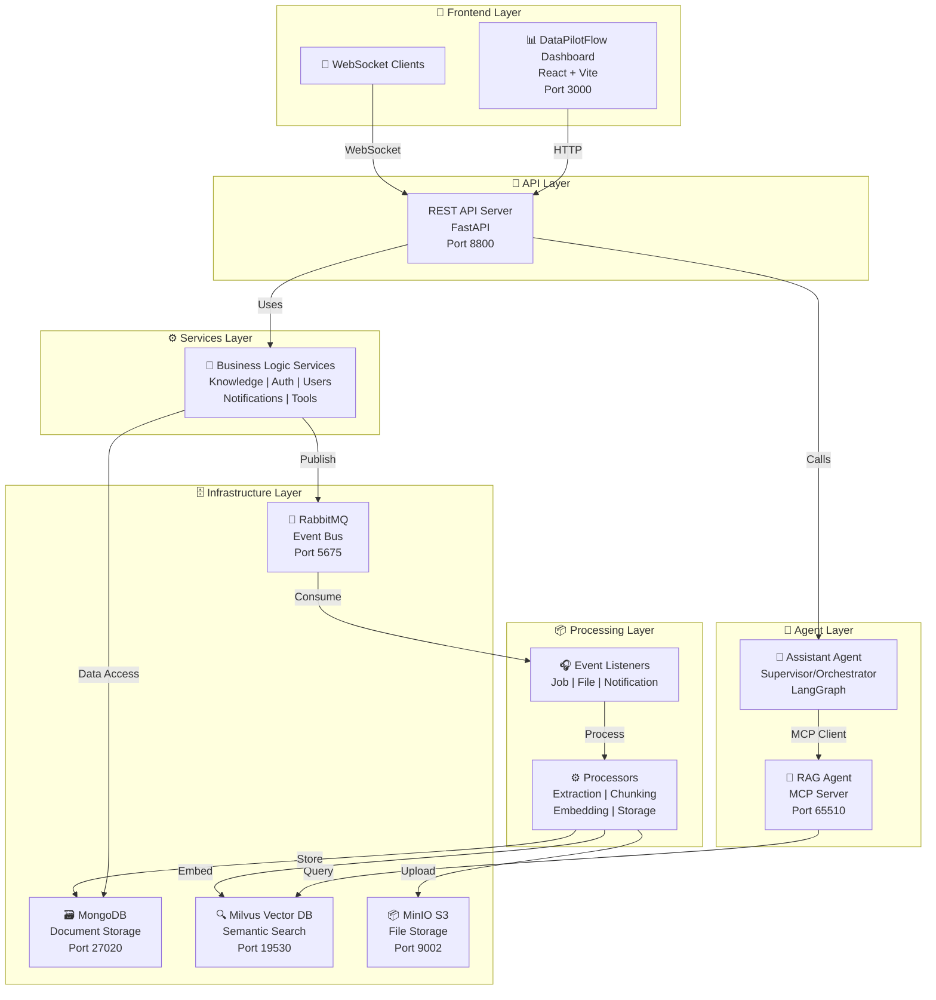
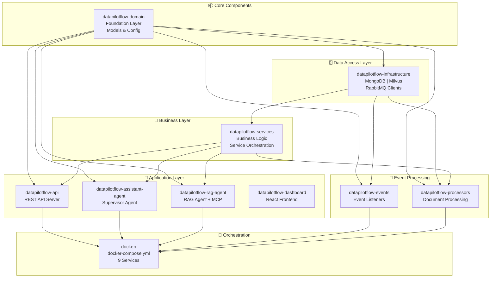
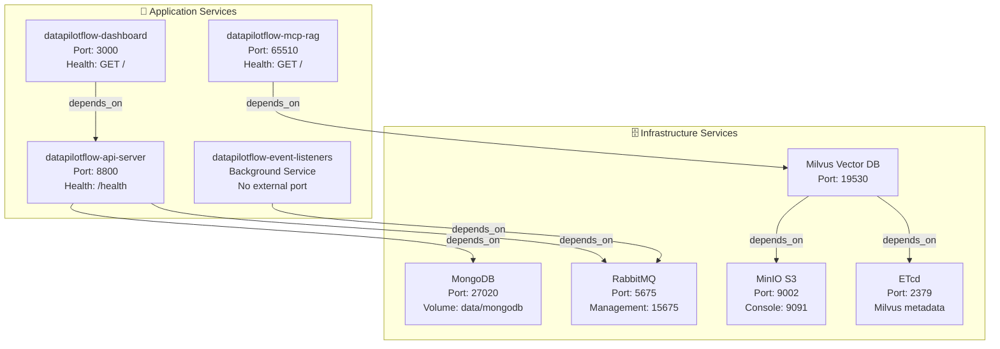
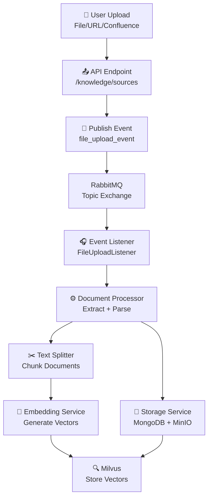
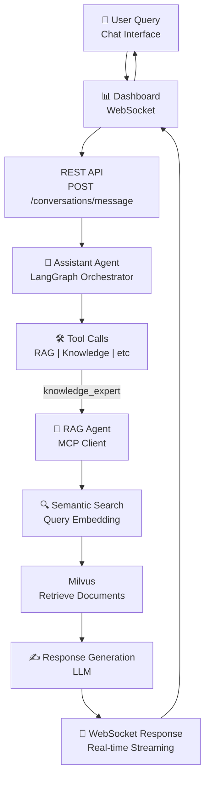
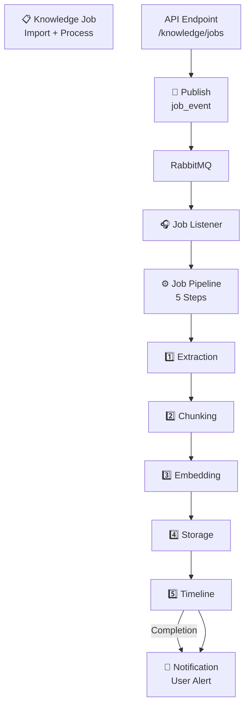
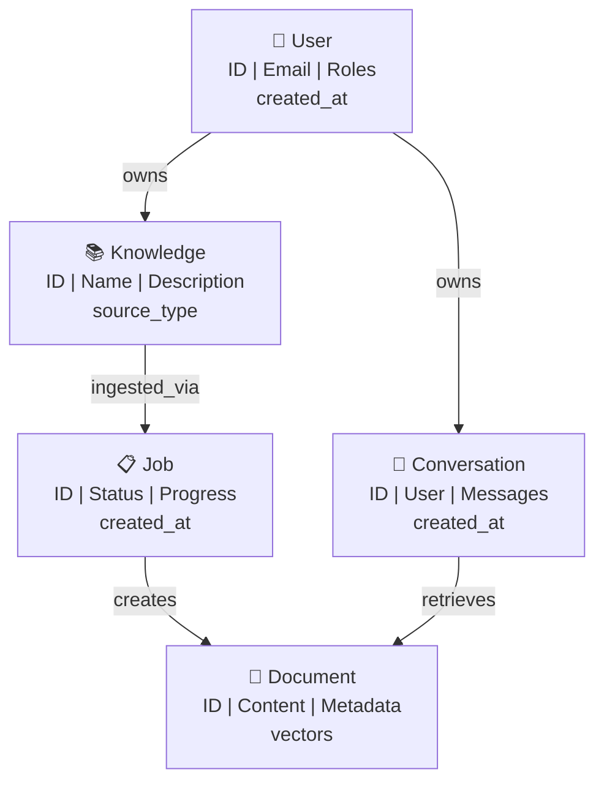

# DataPilotFlow

> **Intelligent Enterprise Knowledge Platform with Retrieval-Augmented Generation**

Transform your enterprise documents into intelligent conversations. DataPilotFlow is an AI-powered knowledge management platform that automatically processes your documents, files, and web content—then lets you ask questions in natural language and get context-aware answers powered by AI.

**In 30 seconds**: Upload documents → AI indexes them → Ask questions → Get intelligent answers with sources cited.

## 🎯 Core Capabilities

- **Multi-Agent Orchestration**: Supervisor agent coordinates RAG agent, tools, and services
- **Retrieval-Augmented Generation (RAG)**: Advanced document retrieval with semantic search
- **Event-Driven Architecture**: Asynchronous processing via RabbitMQ
- **Real-time Document Processing**: Text extraction, chunking, and vector embeddings
- **Vector Database Integration**: Milvus for semantic search and similarity matching
- **WebSocket Support**: Real-time AI responses and job progress tracking
- **MCP Server Exposure**: Model Context Protocol for external agent integration
- **Docker Containerization**: Production-ready deployment with 9 microservices

---

## 🚀 Quick Start (5 Minutes)

```bash
# 1. Start everything
cd docker && docker-compose up -d

# 2. Open dashboard
# http://localhost:3000

# 3. Upload a document
# Click "Knowledge" → "Add Source" → upload a PDF/file

# 4. Ask a question
# Click "Chat" → type your question → see AI answer with sources
```

**System Requirements**: Docker, 10GB disk space, modern browser

---

## 📚 Understanding the Project Layers

DataPilotFlow has **5 layers** that work together to deliver AI-powered knowledge management:

### Layer 1: **Presentation** (What Users See)
- **React Dashboard** at `http://localhost:3000`
- Web UI for uploading documents, managing knowledge, and chatting
- Real-time updates via WebSocket
- **Folder**: `datapilotflow-dashboard/`

### Layer 2: **API** (How Frontend Talks to Backend)
- **FastAPI REST Server** at `http://localhost:8800`
- 30+ API endpoints for knowledge, auth, conversations, agents
- WebSocket support for real-time communication
- JWT-based authentication
- **Folder**: `datapilotflow-api/`

### Layer 3: **AI Agents** (The Intelligence)
- **Assistant Agent**: Supervisor that coordinates multiple tools and agents
- **RAG Agent**: Retrieves relevant documents and generates answers (MCP server on port 65510)
- Both use LangGraph for multi-step orchestration
- **Folders**: `datapilotflow-assistant-agent/`, `datapilotflow-rag-agent/`

### Layer 4: **Services** (Business Logic)
- **KnowledgeService**: Manages document ingestion, processing, storage
- **AuthService**: User authentication and authorization
- **ConversationService**: Multi-turn chat conversations
- **NotificationService**: User alerts and updates
- **ToolService**: External tool management
- **Folder**: `datapilotflow-services/`

### Layer 5: **Infrastructure** (Data & Storage)
- **MongoDB**: Document storage, conversation history, metadata (Port 27020)
- **Milvus**: Vector database for semantic search (Port 19530)
- **RabbitMQ**: Message queue for async jobs (Port 5675)
- **MinIO**: S3-compatible file storage (Port 9002)
- **Folder**: `datapilotflow-infrastructure/`

### Additional Components
- **Domain**: Core data models and validation (`datapilotflow-domain/`)
- **Events**: Event publishing and listening (`datapilotflow-events/`)
- **Processors**: Document processing pipeline (`datapilotflow-processors/`)

**Visual Flow**:
```
User uploads document
    ↓
API receives and validates
    ↓
Event published to RabbitMQ
    ↓
Event listener triggers processor
    ↓
Document extracted, chunked, embedded
    ↓
Stored in MongoDB + Milvus
    ↓
User asks question in chat
    ↓
API routes to Assistant Agent
    ↓
Agent calls RAG Agent for document retrieval
    ↓
RAG searches Milvus for relevant chunks
    ↓
LLM generates answer with sources
    ↓
Response streams to user via WebSocket
```

---

## 👤 For Different Users

### I Want to Use DataPilotFlow
1. Deploy: `cd docker && docker-compose up -d`
2. Open: `http://localhost:3000`
3. Upload documents in Knowledge section
4. Ask questions in Chat section
5. Check **Troubleshooting** section below if issues

### I Want to Understand the Architecture
1. Read sections below: "System Architecture" through "Deployment Checklist"
2. Diagrams show: component relationships, data flows, service dependencies
3. Each module has detailed README explaining its responsibility

### I Want to Contribute Code
1. Read project structure below
2. Pick a module and read its README (in that folder)
3. Follow local development setup in "Local Development" section
4. Each module is independent and can be developed separately

### I Want to Deploy to Production
1. Read "Docker Architecture" section
2. Review environment variables in `.env` file
3. Run: `cd docker && docker-compose up -d`
4. Check services with: `docker-compose ps`
5. See "Deployment Checklist" below

---

## 🆘 Quick Troubleshooting

**Dashboard won't load**
- Check Docker: `docker-compose ps`
- Wait 30 seconds for startup
- Check logs: `docker-compose logs dashboard`

**Knowledge upload fails**
- Check file size (<500MB)
- Verify MongoDB is running: `docker-compose ps | grep mongodb`
- Check logs: `docker-compose logs api`

**Can't ask questions in chat**
- Verify documents were uploaded successfully (check Jobs tab)
- Check API health: `curl http://localhost:8800/health`
- Try smaller question with key terms

**Need API docs**
- Visit: `http://localhost:8800/docs` (Swagger UI)

---

## 🏗️ System Architecture

### High-Level Architecture Diagram



### Service Dependency Tree



---

## 📦 Project Structure

### 8 Core Modules

#### 1. **datapilotflow-domain**
   - **Purpose**: Foundation layer with core domain models
   - **Responsibility**: Pure domain entities, configuration, validation
   - **Dependencies**: Minimal (Pydantic, loguru)
   - **Key Entities**: User, Knowledge, Job, Conversation, Agent, Tool
   - **Status**: Stable - Zero dependencies on other modules

#### 2. **datapilotflow-infrastructure**
   - **Purpose**: Data access and external system integration
   - **Responsibility**: MongoDB client, Milvus vector DB, RabbitMQ connection
   - **Dependencies**: `datapilotflow-domain`
   - **Key Components**: DAOs, Database indexes, Connection pools
   - **Databases**: MongoDB (documents), Milvus (vectors), RabbitMQ (events)

#### 3. **datapilotflow-services**
   - **Purpose**: Business logic and service orchestration
   - **Responsibility**: Knowledge management, user management, notifications, tool orchestration
   - **Dependencies**: `datapilotflow-domain`, `datapilotflow-infrastructure`
   - **Key Services**: KnowledgeService, AuthService, NotificationService, ToolService
   - **Pattern**: Service-Oriented Architecture (SOA)

#### 4. **datapilotflow-api**
   - **Purpose**: REST API and WebSocket exposure
   - **Responsibility**: Request routing, response formatting, endpoint definition
   - **Dependencies**: All modules
   - **Framework**: FastAPI
   - **Port**: 8800
   - **Endpoints**: /auth, /knowledge, /conversations, /agents, /tools, /health

#### 5. **datapilotflow-rag-agent**
   - **Purpose**: Retrieval-Augmented Generation with MCP server
   - **Responsibility**: Document retrieval, semantic search, response generation
   - **Dependencies**: `datapilotflow-domain`, `datapilotflow-infrastructure`, `datapilotflow-services`
   - **Framework**: LangGraph, FastMCP
   - **Port**: 65510
   - **Protocol**: MCP (Model Context Protocol)

#### 6. **datapilotflow-assistant-agent**
   - **Purpose**: Supervisor agent with multi-agent orchestration
   - **Responsibility**: Multi-turn conversations, tool orchestration, agent coordination
   - **Dependencies**: `datapilotflow-domain`, `datapilotflow-infrastructure`, `datapilotflow-services`
   - **Framework**: LangGraph
   - **Pattern**: Supervisor pattern for agent coordination

#### 7. **datapilotflow-events**
   - **Purpose**: Event-driven messaging and async processing
   - **Responsibility**: Event publishing, event listening, queue management
   - **Dependencies**: `datapilotflow-domain`
   - **Message Broker**: RabbitMQ
   - **Event Types**: JobEvents, FileUploadEvents, NotificationEvents

#### 8. **datapilotflow-processors**
   - **Purpose**: Document processing and knowledge ingestion pipeline
   - **Responsibility**: Text extraction, chunking, embedding, web crawling
   - **Dependencies**: `datapilotflow-domain`, `datapilotflow-infrastructure`, `datapilotflow-services`
   - **Processors**: FileProcessor, WebCrawler, DocumentSplitter, EmbeddingProcessor

#### 9. **datapilotflow-dashboard**
   - **Purpose**: Web UI for the platform
   - **Responsibility**: User interaction, job management, knowledge browsing
   - **Framework**: React + Vite + Mantine UI
   - **Port**: 3000
   - **Features**: Real-time updates, file uploads, conversation interface

---

## 🐳 Docker Architecture

### 9-Service Production Deployment



### Service Startup Order

1. **Infrastructure Services** (no dependencies)
   - MongoDB
   - RabbitMQ
   - ETcd
   - MinIO

2. **Vector Database** (depends on infrastructure)
   - Milvus (depends on ETcd + MinIO)

3. **Application Services** (depends on infrastructure)
   - API Server (depends on MongoDB + RabbitMQ) ← Core service
   - Event Listeners (depends on RabbitMQ)
   - RAG MCP Agent (depends on Milvus)
   - Dashboard (depends on API)

### Health Check Configuration

Each service has configured health checks:
- **API Server**: HTTP GET `/health` every 10s
- **Dashboard**: HTTP GET `/` (wget) every 10s
- **RAG MCP**: HTTP GET `/` every 10s
- **Event Listeners**: Process monitoring via `ps aux`

---

## 🔄 Data Flow Diagrams

### Knowledge Ingestion Pipeline



### Query and Response Pipeline



### Job Processing Pipeline



---

## 🚀 Quick Start

### Prerequisites

- Docker & Docker Compose
- Node.js 20+ (for local dashboard development)
- Python 3.11+ (for local development)
- UV package manager

### Production Deployment

```bash
# Navigate to docker directory
cd docker

# Start all services (9 containers)
docker-compose up -d

# Verify all services are healthy
docker-compose ps

# View logs
docker-compose logs -f api
```

### Access Points

| Service | URL | Purpose |
|---------|-----|---------|
| **Dashboard** | http://localhost:3000 | Web UI |
| **API** | http://localhost:8800 | REST API |
| **API Docs** | http://localhost:8800/docs | Swagger UI |
| **RabbitMQ UI** | http://localhost:15675 | Message broker management |
| **MinIO Console** | http://localhost:9002 | S3 storage management |
| **Milvus** | http://localhost:19530 | Vector database |

### Local Development

```bash
# Install dependencies for API
cd datapilotflow-api
uv pip install -e ../datapilotflow-domain -e ../datapilotflow-infrastructure -e ../datapilotflow-services -e .

# Install dependencies for Dashboard
cd ../datapilotflow-dashboard
npm install

# Run API server
cd ../datapilotflow-api
python run_api_server.py

# Run Dashboard (in another terminal)
cd ../datapilotflow-dashboard
npm run dev
```

---

## 📊 Component Interaction Matrix

| Component | Depends On | Used By | Protocol |
|-----------|-----------|---------|----------|
| **Domain** | None | All | Python imports |
| **Infrastructure** | Domain | Services, Events, Processors | Python imports |
| **Services** | Domain, Infrastructure | API, Agents, Processors | Python method calls |
| **API** | Domain, Infrastructure, Services | Dashboard, External clients | HTTP/REST + WebSocket |
| **RAG Agent** | Domain, Infrastructure, Services | Assistant Agent | MCP protocol |
| **Assistant Agent** | Domain, Infrastructure, Services | API | Python/LangGraph |
| **Events** | Domain, Infrastructure | Processors, Event handlers | RabbitMQ messaging |
| **Processors** | Domain, Infrastructure, Services | Background jobs | Event-driven |
| **Dashboard** | None (frontend only) | User interaction | HTTP/WebSocket |

---

## 🔐 Security Architecture

### Service Isolation

- **Network**: Docker bridge network `datapilotflow-network`
- **Authentication**: JWT token-based API access
- **Authorization**: Role-based access control (Admin, User, Viewer)
- **Data Persistence**: Encrypted volumes at `../data/`

### Environment Configuration

```bash
# API Configuration
API_HOST=0.0.0.0
API_PORT=8800
ENVIRONMENT=production

# Database
MONGODB_URI=mongodb://mongodb:27017
MILVUS_HOST=milvus
MILVUS_PORT=19530

# Message Queue
RABBITMQ_HOST=rabbitmq
RABBITMQ_PORT=5675

# LLM Providers
OPENAI_API_KEY=<your-key>
ANTHROPIC_API_KEY=<your-key>
```

---

## 📚 Module Documentation

Each module has detailed documentation:

- [datapilotflow-api/README.md](./datapilotflow-api/README.md) - REST API and endpoints
- [datapilotflow-rag-agent/README.md](./datapilotflow-rag-agent/README.md) - RAG implementation
- [datapilotflow-assistant-agent/README.md](./datapilotflow-assistant-agent/README.md) - Agent orchestration
- [datapilotflow-services/README.md](./datapilotflow-services/README.md) - Business logic
- [datapilotflow-domain/README.md](./datapilotflow-domain/README.md) - Domain models
- [datapilotflow-infrastructure/README.md](./datapilotflow-infrastructure/README.md) - Data access
- [datapilotflow-events/README.md](./datapilotflow-events/README.md) - Event system
- [datapilotflow-processors/README.md](./datapilotflow-processors/README.md) - Document processing
- [docker/README.md](./docker/README.md) - Docker deployment

---

## 🔧 Technology Stack

| Layer | Technology | Purpose |
|-------|-----------|---------|
| **Frontend** | React 18, Vite, Mantine UI | Web dashboard |
| **API** | FastAPI, Python 3.11 | REST endpoints |
| **Agents** | LangGraph, FastMCP | AI orchestration |
| **Services** | Python, Pydantic | Business logic |
| **Data Storage** | MongoDB 7.0 | Document persistence |
| **Vector Search** | Milvus 2.4 | Semantic search |
| **Message Queue** | RabbitMQ 3.12 | Event streaming |
| **File Storage** | MinIO (S3-compatible) | Object storage |
| **Orchestration** | Docker Compose | Container management |
| **Package Manager** | UV | Python dependency management |

---

## 📈 Performance Characteristics

### Scalability

- **Horizontal**: Event listeners can run in parallel
- **Vertical**: Vector embeddings batched for efficiency
- **Database**: MongoDB sharding, Milvus partitioning

### Latency

- **API Response**: <200ms for simple queries
- **RAG Pipeline**: <2s for document retrieval + generation
- **WebSocket**: Real-time (sub-100ms) for updates

### Throughput

- **Document Ingestion**: 1000+ documents/minute
- **Concurrent Users**: 100+ WebSocket connections
- **API Requests**: 1000+ requests/second

---

## 🔄 Data Models

### Core Entities



### Event Types

- **JobEvent**: Job created/started/completed/failed
- **FileUploadEvent**: File uploaded and ready for processing
- **NotificationEvent**: System or user notifications
- **TimelineEvent**: Job step transitions

---

## 🚦 Deployment Checklist

- [ ] Docker daemon running
- [ ] Port 3000, 5675, 8800, 19530, 27020 available
- [ ] 10GB+ free disk space for data volumes
- [ ] Environment variables configured
- [ ] SSL certificates (for production)
- [ ] Monitoring/logging setup

---

## 📞 Support & Contributing

For detailed API documentation, see [http://localhost:8800/docs](http://localhost:8800/docs) after deployment.

For contribution guidelines and development setup, see individual module READMEs.

---

## 📄 License

DataPilotFlow © 2025. All rights reserved.

---

**Last Updated**: December 29, 2025
**Status**: Production Ready
**Version**: 1.0.0
