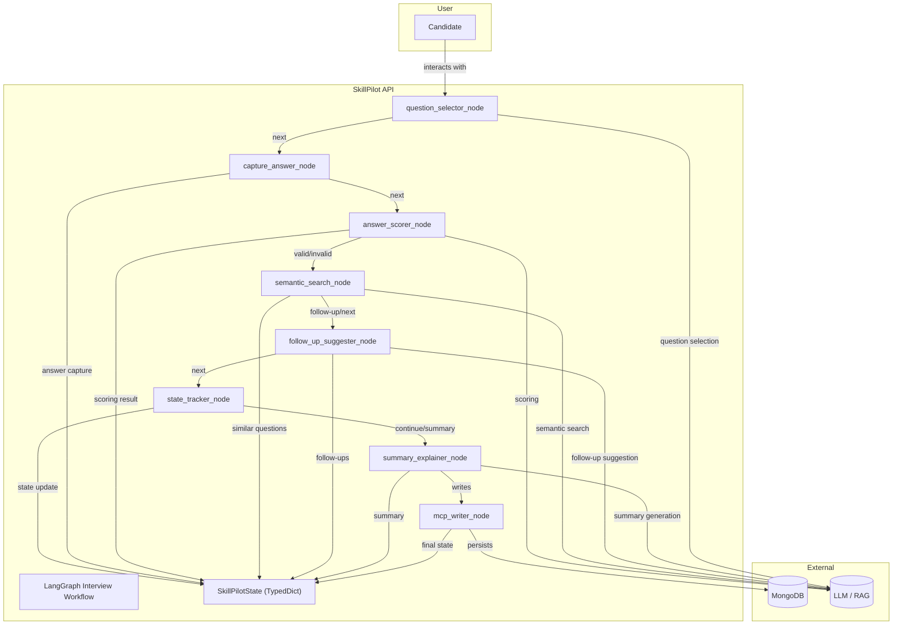
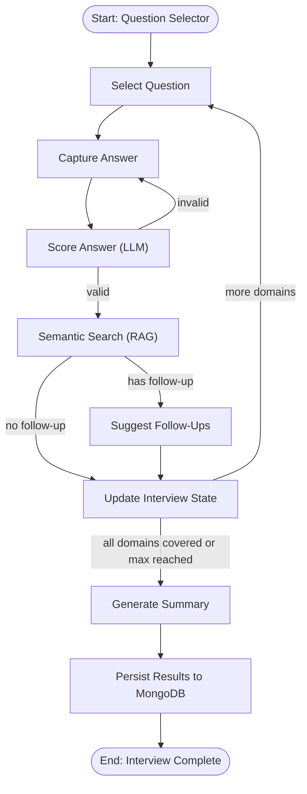

# 🧠 SkillPilot AI Agent Framework

SkillPilot is an AI-powered interview co-pilot designed to support technical interviewers by dynamically selecting questions, scoring answers, suggesting follow-ups, and summarizing interview sessions.

---

## 🚀 What is SkillPilot?

SkillPilot automates and augments the technical interview process using a graph-based workflow, LLMs, and semantic retrieval. It ensures a structured, fair, and adaptive interview experience, tracks all relevant state, and generates actionable summaries and recommendations.

---

## 🏗️ High-Level Architecture



---

## 🔑 Key Capabilities

- **Live Adaptive Question Flow:** Dynamically selects questions, tracks domains, and avoids repetition.
- **Smart Answer Scoring:** Uses LLMs to score answers and provide rationale.
- **Semantic Question Retrieval:** Fetches similar questions using vector search.
- **Follow-up Suggestions:** LLM suggests follow-up questions for deeper probing.
- **State-Aware Flow:** Tracks all relevant interview state and history.
- **Summary Generation:** Produces a final summary and recommendation.
- **MongoDB Storage:** Persists all interview data for future analysis.

---

## 🧩 Core Components

- **LangGraph Workflow:** Orchestrates the interview as a directed graph with nodes and conditional edges.
- **SkillPilotState:** TypedDict that tracks all session data.
- **Node Functions:** Each interview step is a function (question selection, answer capture, scoring, etc.).
- **Conditional Routing:** Graph edges are determined by state and LLM outputs.
- **Persistence:** Final results are saved to MongoDB.

---

## 📝 Example Workflow



---

## 🧬 Nodes

| Node Key               | Description |
|------------------------|-------------|
| `question_selector`    | Selects the next question based on uncovered domains, candidate level, and history. |
| `capture_answer`       | Captures and stores the candidate's answer text for scoring. |
| `answer_scorer`        | Uses an LLM to evaluate the answer, providing a score and rationale based on rubric criteria. |
| `semantic_search`      | Performs vector-based semantic retrieval of similar questions from the knowledge base. |
| `follow_up_suggester`  | Uses an LLM to suggest 2–3 follow-up questions to continue the same topic. |
| `state_tracker`        | Updates internal session state: score history, covered domains, notes, asked questions. |
| `summary_explainer`    | Summarizes interview performance using an LLM based on scoring and state data. |
| `mcp_writer`           | Persists the final interview session summary, notes, and recommendation to MongoDB. |

---

## 🛠️ Enhancements & Improvements

### **Short-Term**
- **Robust Error Handling:** Add try/except blocks and logging in all node functions.
- **Unit & Integration Tests:** Use pytest to cover all nodes and state transitions.
- **Configurable Graph:** Allow interview flow to be customized via config or UI.
- **API Documentation:** Use FastAPI's OpenAPI docs for all endpoints.

### **Medium-Term**
- **UI/UX:** Build a Streamlit or React-based interviewer dashboard.
- **Analytics:** Add dashboards for interview analytics, domain coverage, and candidate performance.
- **Role/Domain Templates:** Allow easy creation of new interview templates for different roles.
- **Feedback Loop:** Let interviewers override scores and provide feedback to improve LLM prompts.

### **Long-Term**
- **Chat Memory:** Integrate persistent chat memory for multi-session interviews.
- **Multi-LLM Support:** Allow pluggable LLM backends (OpenAI, Anthropic, local models).
- **Automated Calibration:** Use historical data to auto-tune scoring and follow-up logic.
- **Security & Compliance:** Add audit logging, PII redaction, and RBAC for enterprise use.

---

## 📦 Setup

```bash
uv venv skillpilot
uv pip install -r requirements.txt
```

Set environment variables:
```env
MONGODB_URI=...
RAG_TEXT_EMBEDDING_MODEL_ID=...
RAG_DEVICE=cuda
RAG_TOP_K=3
```

---

## 👥 Maintainers

Built and maintained by architects for architects.  
Reach out if you'd like to extend SkillPilot into your hiring pipeline.

## 📖 Example Scenario

Suppose you are conducting an interview for the role of **Senior Backend Engineer**. The interview session is named `backend_interview_2024_06_13`.

### **Session Setup**
- **Interview Name:** `backend_interview_2024_06_13`
- **Candidate Name:** Jane Doe
- **Role:** Senior Backend Engineer
- **Level:** Senior
- **Domains:** `["System Design", "API Security", "Microservices"]`

### **How the Interview Flows**

1. **Start:**  
   The system selects the first question from the "System Design" domain.

2. **Capture Answer:**  
   Jane answers:  
   _"I would use Redis with geo-replication and a CDN for global caching..."_

3. **Score Answer:**  
   The LLM scores the answer as `4/5` and provides rationale.

4. **Semantic Search:**  
   The system retrieves similar questions, e.g.,  
   _"How would you handle cache invalidation in a distributed system?"_

5. **Follow-Up Suggestion:**  
   The LLM suggests:  
   - "What consistency model would you apply across regions?"
   - "How would you handle failover if Redis is unavailable?"

6. **State Tracking:**  
   The system records Jane's answer, score, and updates domain coverage.

7. **Repeat or Summarize:**  
   The process repeats for other domains until all are covered or the max number of questions is reached.

8. **Summary & Recommendation:**  
   The LLM generates a summary:  
   _"Jane demonstrated strong system design and security knowledge..."_  
   **Recommendation:** _Strong Hire_

9. **Persist Results:**  
   The full session, including all answers, scores, and summary, is saved to MongoDB.

## 🚦 Future Roadmap

### 🎤 Whisper Integration for Seamless Interviews

To further elevate the SkillPilot experience, we plan to integrate OpenAI's Whisper for real-time, automated speech-to-text transcription. This will:
- Enable fully voice-driven interviews, making the process more natural and human-centric.
- Allow candidates and interviewers to interact hands-free, reducing friction and boosting engagement.
- Instantly convert spoken answers into text for scoring, semantic search, and follow-up generation.
- Unlock accessibility for candidates with diverse communication preferences.

**With Whisper, SkillPilot will set a new standard for intelligent, conversational, and inclusive technical interviews—empowering organizations to discover talent with unprecedented ease and accuracy.**
