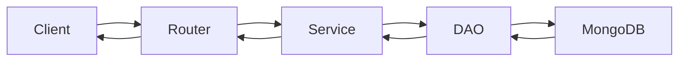
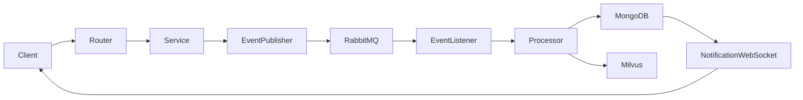

# datapilotflow-api

**REST API and WebSocket server — the single entry point for the dashboard and external clients.**

This package exposes all platform capabilities over HTTP and WebSocket using FastAPI. It delegates business logic entirely to the services layer and routes agent interactions to the assistant and RAG agents.

---

## Responsibility

- Expose REST endpoints for all platform domains
- Handle WebSocket connections for real-time agent streaming and notifications
- Enforce JWT authentication and role-based access control on every route
- Validate all incoming requests via Pydantic schemas
- Serve OpenAPI documentation at `/docs`

---

## Package Structure

```
src/datapilotflow/api/
├── server.py                          # FastAPI app setup, middleware, startup hooks
├── config.py                          # API-specific configuration (APISettings)
├── dependencies/
│   └── permissions.py                 # JWT validation and RBAC dependencies
└── routers/
    ├── health/
    │   └── health_router.py           # GET /health
    ├── auth/
    │   └── auth_router.py             # POST /auth/login, /auth/refresh
    ├── users/
    │   ├── users_router.py            # CRUD /users
    │   └── roles_router.py            # CRUD /roles
    ├── knowledge/
    │   ├── knowledge_router.py        # CRUD /knowledge
    │   ├── knowledge_job_router.py    # CRUD /knowledge/jobs
    │   ├── knowledge_source_router.py # CRUD /knowledge/sources
    │   ├── knowledge_source_preview_router.py  # Source preview
    │   ├── knowledge_collection_router.py      # Collection management
    │   ├── job_timeline_router.py     # Job step timeline
    │   ├── document_splitter_router.py # Splitter configuration
    │   └── llm_content_filter_router.py # Content filter config
    ├── agent/
    │   ├── agent_router.py            # CRUD /agents
    │   ├── assistant_websocket_router.py  # WS /ws/assistant — streaming chat
    │   └── rag_websocket_router.py    # WS /ws/rag — RAG queries
    ├── conversation/
    │   └── conversation_router.py     # CRUD /conversations
    ├── notifications/
    │   ├── notification_router.py     # GET /notifications
    │   └── notification_websocket_router.py  # WS /ws/notifications
    ├── model_provider/
    │   ├── model_provider_router.py   # CRUD /model-providers
    │   └── litellm_router.py          # LiteLLM proxy routes
    ├── tools/
    │   ├── tools_router.py            # CRUD /tools
    │   └── mcp_servers_router.py      # CRUD /mcp-servers
    └── vectordb/
        └── collection_router.py       # Vector collection status
```

---

## API Endpoints

| Group | Base Path | Description |
|-------|-----------|-------------|
| Health | `/health` | Service health check |
| Auth | `/api/v1/auth` | Login and token management |
| Users | `/api/v1/users` | User management |
| Roles | `/api/v1/roles` | Role management |
| Knowledge | `/api/v1/knowledge` | Knowledge base management |
| Jobs | `/api/v1/knowledge/jobs` | Ingestion job lifecycle |
| Sources | `/api/v1/knowledge/sources` | Source configuration |
| Agents | `/api/v1/agents` | Agent management |
| Conversations | `/api/v1/conversations` | Conversation history |
| Notifications | `/api/v1/notifications` | Notification feed |
| Model Providers | `/api/v1/model-providers` | LLM provider config |
| Tools | `/api/v1/tools` | Tool registry |
| MCP Servers | `/api/v1/mcp-servers` | MCP server registry |
| Vector DB | `/api/v1/vectordb` | Vector collection status |

**WebSocket endpoints:**

| Path | Description |
|------|-------------|
| `/ws/assistant` | Streaming chat with the Assistant Agent |
| `/ws/rag` | Direct RAG agent queries |
| `/ws/notifications` | Real-time notification delivery |

Full interactive documentation: `http://localhost:8800/docs`

---

## Request Flow

**Synchronous (immediate response)**:



**Asynchronous (event-driven)**:



---

## Running the Server

```bash
cd datapilotflow-api
python run_api_server.py
```

The server starts on `API_SERVER_HOST:API_SERVER_PORT` (default `0.0.0.0:8800`).

---

## Dependencies

```
datapilotflow-domain >= 1.0.0
datapilotflow-infrastructure >= 1.0.0
datapilotflow-services >= 1.0.0
datapilotflow-rag-agent >= 1.0.0
datapilotflow-assistant-agent >= 1.0.0
datapilotflow-processors >= 1.0.0
fastapi[standard] >= 0.115.8
uvicorn >= 0.24.0
langgraph >= 1.0.2
langgraph-checkpoint-mongodb >= 0.1.0
PyJWT >= 2.10.0
pydantic >= 2.10.6
loguru >= 0.7.3
```

---

## Installation

```bash
cd datapilotflow-api
uv pip install \
  -e ../datapilotflow-domain \
  -e ../datapilotflow-infrastructure \
  -e ../datapilotflow-services \
  -e ../datapilotflow-rag-agent \
  -e ../datapilotflow-assistant-agent \
  -e ../datapilotflow-processors \
  -e .
```
