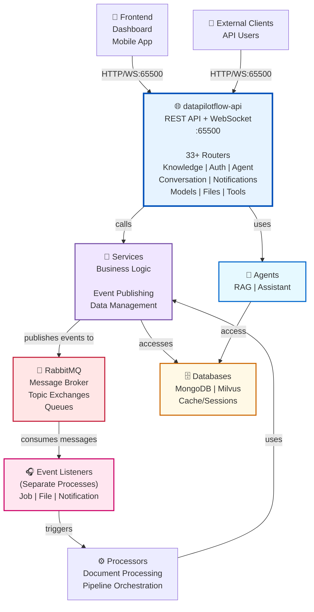
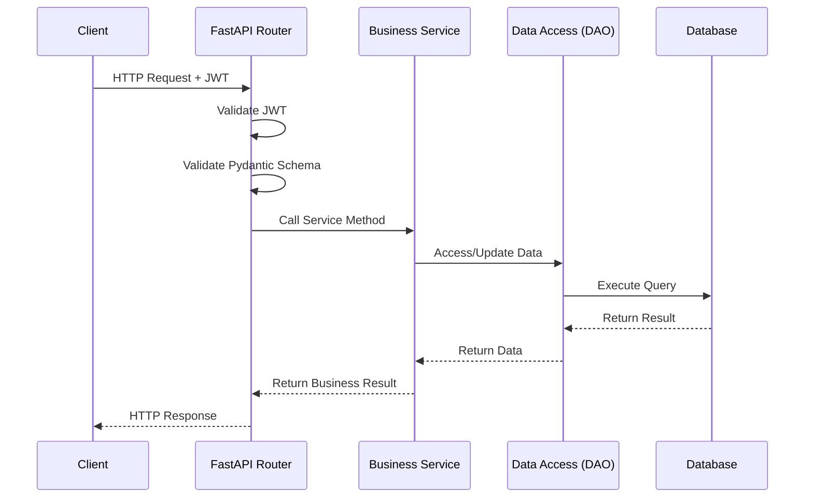
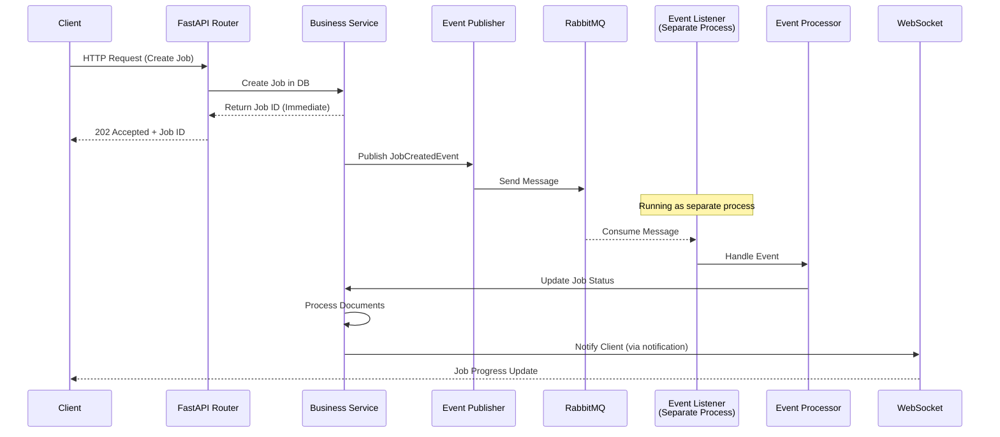

# DataPilotFlow API

**API Layer - REST API and WebSocket Exposure**

The `datapilotflow-api` package provides the REST API and WebSocket endpoints for the DataPilotFlow platform. It orchestrates all services and agents to provide a unified API interface.

## 📦 Package Overview

- **Version**: 1.0.0
- **Python**: >=3.11
- **Dependencies**: All DataPilotFlow packages
- **Purpose**: API exposure layer for UI and integrations

## 🏗️ Architecture Position

### System Architecture Diagram



**Key Architectural Points**:

1. **Event-Driven Decoupling**:
   - Services publish events to RabbitMQ (not directly to Event Listeners)
   - Event Listeners (running as separate processes) consume messages from RabbitMQ
   - This provides complete decoupling and allows independent scaling
   - API requests trigger events asynchronously without waiting for processing

2. **Layered Processing**:
   - Synchronous: API → Services → Databases (immediate response to client)
   - Asynchronous: Services → RabbitMQ → Event Listeners → Processors → Services (background work)

3. **No Direct Dependencies**:
   - API doesn't know about Event Listeners
   - Services don't directly depend on Event Listeners
   - Only integration point is RabbitMQ message broker
   - Processors can use Services to update state after event processing

**This package provides**:
- REST API endpoints (FastAPI)
- WebSocket endpoints for real-time communication
- Authentication and authorization
- Request/response validation
- API documentation (OpenAPI/Swagger)
- Event publishing through services (JobEventPublisher, FileUploadEventPublisher, etc.)

## 📁 Package Structure

```
datapilotflow-api/
├── src/datapilotflow/api/
│   ├── __init__.py
│   ├── server.py              # FastAPI application
│   ├── config.py              # API configuration
│   │
│   ├── routers/                # API routers
│   │   ├── agent/
│   │   │   ├── agent_router.py
│   │   │   └── assistant_websocket_router.py
│   │   ├── knowledge/
│   │   │   ├── knowledge_router.py
│   │   │   ├── knowledge_job_router.py
│   │   │   └── document_splitter_router.py
│   │   ├── conversation/
│   │   │   └── conversation_router.py
│   │   ├── auth/
│   │   │   └── auth_router.py
│   │   ├── notifications/
│   │   │   └── notification_router.py
│   │   ├── model_provider/
│   │   │   └── model_provider_router.py
│   │   ├── users/
│   │   │   └── user_router.py
│   │   ├── tools/
│   │   │   └── tool_router.py
│   │   └── vectordb/
│   │       └── vectordb_router.py
│   │
│   ├── middleware/             # Middleware
│   │   ├── auth.py
│   │   └── error_handling.py
│   │
│   └── dependencies/           # Dependency injection
│       ├── auth.py
│       └── services.py
│
├── run_api_server.py           # API server entry point
├── tests/
├── pyproject.toml
└── README.md
```

## 🔑 Key Components

### 1. FastAPI Application (`server.py`)

**Main Application**: FastAPI app with all routers

**Features**:
- CORS configuration
- Middleware setup
- Router registration
- WebSocket support
- OpenAPI documentation

### 2. API Routers

**Knowledge Routers**:
- `knowledge_router.py` - Knowledge source management
- `knowledge_job_router.py` - Knowledge job operations
- `document_splitter_router.py` - Document splitting

**Agent Routers**:
- `agent_router.py` - Agent operations
- `assistant_websocket_router.py` - WebSocket for assistant agent

**Other Routers**:
- `auth_router.py` - Authentication
- `conversation_router.py` - Conversation management
- `notification_router.py` - Notifications
- `model_provider_router.py` - Model providers
- `user_router.py` - User management
- `tool_router.py` - Tools and MCP servers
- `vectordb_router.py` - Vector database collections

### 3. Authentication Middleware

**JWT Authentication**: Token-based authentication

**Features**:
- JWT token validation
- User authentication
- Role-based access control

## 🔗 How This Package Uses Lower Layers

### Uses Services
```python
from datapilotflow.services.knowledge import KnowledgeJobService
from datapilotflow.services.auth import AuthService
from datapilotflow.services.conversation import ConversationHistoryService

# API uses all services
job_service = KnowledgeJobService()
auth_service = AuthService()
conversation_service = ConversationHistoryService()
```

### Uses Agents
```python
from datapilotflow.assistant_agent import AssistantAgentService
from datapilotflow.rag_agent import RAGAgentService

# API can use agents directly
assistant_agent = AssistantAgentService()
rag_agent = RAGAgentService()
```

### Uses Infrastructure
```python
# API uses infrastructure through services
# (API → Services → Infrastructure)
```

### Uses Domain
```python
from datapilotflow.domain.config import settings
from datapilotflow.domain.knowledge import KnowledgeJob

# API uses domain models for validation
# API uses config for settings
```

## 📦 Dependencies

### DataPilotFlow Dependencies
- `datapilotflow-domain>=1.0.0` - Domain models and configuration
- `datapilotflow-infrastructure>=1.0.0` - Database access
- `datapilotflow-services>=1.0.0` - Business logic services
- `datapilotflow-rag-agent>=1.0.0` - RAG agent
- `datapilotflow-assistant-agent>=1.0.0` - Assistant agent

### External Dependencies
- `fastapi[standard]>=0.115.8` - FastAPI framework
- `uvicorn>=0.24.0` - ASGI server
- `langgraph>=1.0.2` - Agent workflows
- `langgraph-checkpoint-mongodb>=0.1.0` - State checkpoints
- `PyJWT>=2.10.0` - JWT handling
- `python-multipart>=0.0.20` - File uploads
- `pydantic>=2.10.6` - Data validation
- `loguru>=0.7.3` - Logging
- `opik>=1.9.11` - Observability

## 📋 Module Capabilities

### 1. **REST API Endpoints**
- **Knowledge Management** (jobs, sources, documents, collections)
- **Authentication & Authorization** (login, user management, roles)
- **Agent Management** (RAG, Assistant agent operations)
- **Conversation Management** (chat history, multi-turn)
- **Notifications** (real-time updates, delivery)
- **Vector Database** (collection management, search)
- **Model Providers** (LLM configuration)
- **File Management** (uploads, processing)
- **Tool & MCP** (server management, tool configuration)

### 2. **WebSocket Real-Time Communication**
- Assistant agent streaming responses
- RAG agent interactions
- Job progress notifications
- Real-time status updates

### 3. **Authentication**
- JWT token-based authentication
- Role-based access control (RBAC)
- User session management

### 4. **Documentation**
- OpenAPI/Swagger UI at `/docs`
- ReDoc at `/redoc`
- JSON schema at `/openapi.json`

## 🔄 API Request Flow - Synchronous vs Event-Driven

### Synchronous Request Flow (Immediate Response)


### Asynchronous Event-Driven Flow (Background Processing)


### Complete Request-Response-Notification Flow
```
1. SYNCHRONOUS (Blocking):
   Client → API Router → Service → DAO → Database
   ↑ Return immediate response (202 Accepted for async)

2. ASYNCHRONOUS (Non-blocking):
   Service → Event Publisher → RabbitMQ
   Event Listener (separate process) ← consumes
   → Event Processor → Service (update state)
   → WebSocket/Notification → Client (eventual notification)
```

## 🚀 Installation

### Prerequisites
- Python >=3.11
- All lower-layer packages installed
- MongoDB, Milvus, RabbitMQ running
- RAG MCP server accessible (if using RAG features)

### Install All Dependencies

```bash
uv pip install -e ../datapilotflow-domain \
  -e ../datapilotflow-infrastructure \
  -e ../datapilotflow-services \
  -e ../datapilotflow-processors \
  -e ../datapilotflow-events \
  -e ../datapilotflow-rag-agent \
  -e ../datapilotflow-assistant-agent \
  -e .
```


## 📚 Related Packages

**Depends on**:
- ✅ All DataPilotFlow packages

**Used by**:
- ✅ Frontend applications
- ✅ External integrations
- ✅ API clients

## 🎯 Design Principles

1. **RESTful API**: Standard REST endpoints
2. **WebSocket Support**: Real-time communication
3. **Service Orchestration**: Coordinates all services
4. **Authentication**: JWT-based security
5. **Validation**: Pydantic request/response validation
6. **Service-Specific Logging**: Dedicated log file

## 🔧 Configuration

API uses configuration from `datapilotflow-domain`:

```python
from datapilotflow.domain.config import settings

# API Configuration
API_SERVER_HOST = settings.API_SERVER_HOST
API_SERVER_PORT = settings.API_SERVER_PORT
WEBSOCKET_TIMEOUT = settings.WEBSOCKET_TIMEOUT

# JWT Configuration
JWT_SECRET_KEY = settings.JWT_SECRET_KEY
```

## 🛠️ How to Build & Start

### Build Steps

1. **Install all dependencies in order**
   ```bash
   cd ../datapilotflow-domain && pip install -e .
   cd ../datapilotflow-infrastructure && pip install -e .
   cd ../datapilotflow-services && pip install -e .
   cd ../datapilotflow-processors && pip install -e .
   cd ../datapilotflow-events && pip install -e .
   cd ../datapilotflow-rag-agent && pip install -e .
   cd ../datapilotflow-assistant-agent && pip install -e .
   cd ../datapilotflow-api && pip install -e .
   ```

2. **Configure environment**
   ```bash
   cat > .env << EOF
   # API Configuration
   API_SERVER_HOST=0.0.0.0
   API_SERVER_PORT=65500

   # Database
   MONGO_CONN_STR=mongodb://localhost:27017
   MONGO_DB_NAME=datapilotflow

   # Vector DB
   VECTOR_DB_HOST=localhost
   VECTOR_DB_HTTP_PORT=19530

   # Message Queue
   RABBITMQ_HOST=localhost
   RABBITMQ_PORT=5672

   # JWT
   JWT_SECRET_KEY=your-secret-key-here

   # MCP Servers
   MCP_SERVER_HOST=localhost
   MCP_SERVER_PORT=65510
   EOF
   ```

3. **Start infrastructure services** (if using Docker)
   ```bash
   cd ../../docker
   docker-compose up -d mongodb milvus rabbitmq
   ```

### Starting the API Server

```bash
# Standard startup
python run_api_server.py

# With custom host/port
API_SERVER_HOST=127.0.0.1 API_SERVER_PORT=8000 python run_api_server.py

# With verbose logging
export DATAPILOTFLOW_LOG_LEVEL=DEBUG
python run_api_server.py
```

### API Server Information

Once running, access:
- **API**: http://localhost:65500
- **Swagger UI**: http://localhost:65500/docs
- **ReDoc**: http://localhost:65500/redoc
- **Health Check**: http://localhost:65500/api/health
- **WebSocket Assistant**: ws://localhost:65500/ws/assistant

### Development Setup

```bash
# Create virtual environment
python -m venv venv
source venv/bin/activate  # On Windows: venv\Scripts\activate

# Install with dev dependencies
pip install -e ".[dev]"

# Run tests
pytest tests/ -v

# Run API with auto-reload
uvicorn datapilotflow.api.server:app --reload --host 0.0.0.0 --port 65500
```

### Complete System Startup (All Services)

```bash
# Terminal 1: Start infrastructure
cd docker && docker-compose up

# Terminal 2: Start RAG MCP server
cd datapilotflow-rag-agent
python run_rag_mcp_server.py

# Terminal 3: Start event listeners
cd datapilotflow-events
python run_all_event_listeners.py

# Terminal 4: Start API server
cd datapilotflow-api
python run_api_server.py

# Terminal 5: Monitor logs
tail -f logs/api.log
tail -f logs/rag-agent.log
tail -f logs/*-event-listener.log
```

## 📖 Documentation

For more details on specific components:
- **API Server**: See [src/datapilotflow/api/server.py](src/datapilotflow/api/server.py)
- **Routers**: See [src/datapilotflow/api/routers/](src/datapilotflow/api/routers/)
- **Middleware**: See [src/datapilotflow/api/middleware/](src/datapilotflow/api/middleware/)
- **API Docs**: Available at `/docs` when server is running

## 🚀 Deployment

### Prerequisites for Production
- MongoDB cluster (for high availability)
- Milvus cluster (for vector search)
- RabbitMQ cluster (for message queue)
- RAG MCP server (for knowledge retrieval)
- Redis (optional, for session caching)

### Production Configuration
- Use environment variables for secrets
- Enable CORS appropriately
- Setup JWT key rotation
- Configure logging and monitoring
- Setup health checks and auto-restart

### Docker Deployment

```bash
# Build API image
docker build -t datapilotflow-api:latest .

# Run API container
docker run -p 65500:65500 \
  -e MONGO_CONN_STR=mongodb://mongo:27017 \
  -e VECTOR_DB_HOST=milvus \
  -e RABBITMQ_HOST=rabbitmq \
  datapilotflow-api:latest
```

