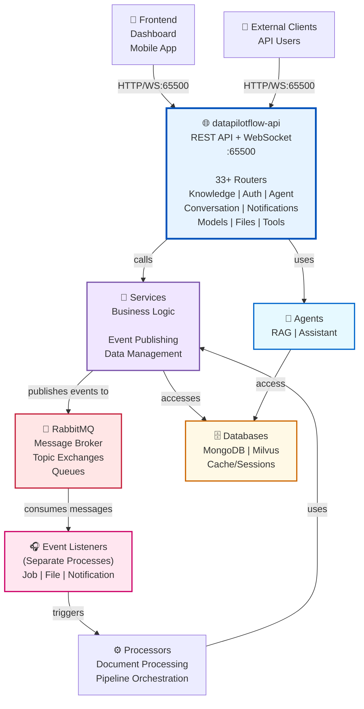
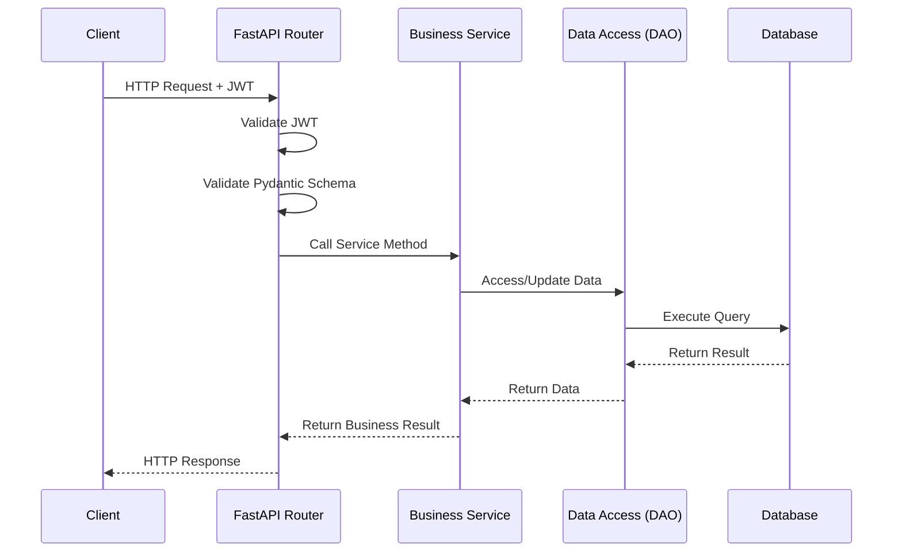

# DataPilotFlow API

**API Layer - REST API and WebSocket Exposure**

The `datapilotflow-api` package provides the REST API and WebSocket endpoints for the DataPilotFlow platform. It orchestrates all services and agents to provide a unified API interface.

## 🏗️ Architecture Position

### System Architecture Diagram



**Key Architectural Points**:

1. **Event-Driven Decoupling**:
   - Services publish events to RabbitMQ (not directly to Event Listeners)
   - Event Listeners (running as separate processes) consume messages from RabbitMQ
   - This provides complete decoupling and allows independent scaling
   - API requests trigger events asynchronously without waiting for processing

2. **Layered Processing**:
   - Synchronous: API → Services → Databases (immediate response to client)
   - Asynchronous: Services → RabbitMQ → Event Listeners → Processors → Services (background work)

3. **No Direct Dependencies**:
   - API doesn't know about Event Listeners
   - Services don't directly depend on Event Listeners
   - Only integration point is RabbitMQ message broker
   - Processors can use Services to update state after event processing

**This package provides**:
- REST API endpoints (FastAPI)
- WebSocket endpoints for real-time communication
- Authentication and authorization
- Request/response validation
- API documentation (OpenAPI/Swagger)
- Event publishing through services (JobEventPublisher, FileUploadEventPublisher, etc.)

## 📋 Module Capabilities

### 1. **REST API Endpoints**
- **Knowledge Management** (jobs, sources, documents, collections)
- **Authentication & Authorization** (login, user management, roles)
- **Agent Management** (RAG, Assistant agent operations)
- **Conversation Management** (chat history, multi-turn)
- **Notifications** (real-time updates, delivery)
- **Vector Database** (collection management, search)
- **Model Providers** (LLM configuration)
- **File Management** (uploads, processing)
- **Tool & MCP** (server management, tool configuration)

### 2. **WebSocket Real-Time Communication**
- Assistant agent streaming responses
- RAG agent interactions
- Job progress notifications
- Real-time status updates

### 3. **Authentication**
- JWT token-based authentication
- Role-based access control (RBAC)
- User session management

### 4. **Documentation**
- OpenAPI/Swagger UI at `/docs`
- ReDoc at `/redoc`
- JSON schema at `/openapi.json`

## 🔄 API Request Flow - Synchronous vs Event-Driven

### Synchronous Request Flow (Immediate Response)

### Complete Request-Response-Notification Flow
```
1. SYNCHRONOUS (Blocking):
   Client → API Router → Service → DAO → Database
   ↑ Return immediate response (202 Accepted for async)

2. ASYNCHRONOUS (Non-blocking):
   Service → Event Publisher → RabbitMQ
   Event Listener (separate process) ← consumes
   → Event Processor → Service (update state)
   → WebSocket/Notification → Client (eventual notification)
```

## 🚀 Installation

### Prerequisites
- Python >=3.11
- All lower-layer packages installed
- MongoDB, Milvus, RabbitMQ running
- RAG MCP server accessible (if using RAG features)

### Install All Dependencies

```bash
uv pip install -e ../datapilotflow-domain \
  -e ../datapilotflow-infrastructure \
  -e ../datapilotflow-services \
  -e ../datapilotflow-processors \
  -e ../datapilotflow-events \
  -e ../datapilotflow-rag-agent \
  -e ../datapilotflow-assistant-agent \
  -e .
```

## 🛠️ How to Build & Start

### Build Steps

1. **Install all dependencies in order**
   ```bash
   cd ../datapilotflow-domain && pip install -e .
   cd ../datapilotflow-infrastructure && pip install -e .
   cd ../datapilotflow-services && pip install -e .
   cd ../datapilotflow-processors && pip install -e .
   cd ../datapilotflow-events && pip install -e .
   cd ../datapilotflow-rag-agent && pip install -e .
   cd ../datapilotflow-assistant-agent && pip install -e .
   cd ../datapilotflow-api && pip install -e .
   ```

2. **Start infrastructure services** (if using Docker)
   ```bash
   cd ../../docker
   docker-compose up -d mongodb milvus rabbitmq
   ```

### Starting the API Server

```bash
# Standard startup
python run_api_server.py

# With custom host/port
API_SERVER_HOST=127.0.0.1 API_SERVER_PORT=8000 python run_api_server.py

# With verbose logging
export DATAPILOTFLOW_LOG_LEVEL=DEBUG
python run_api_server.py
```
