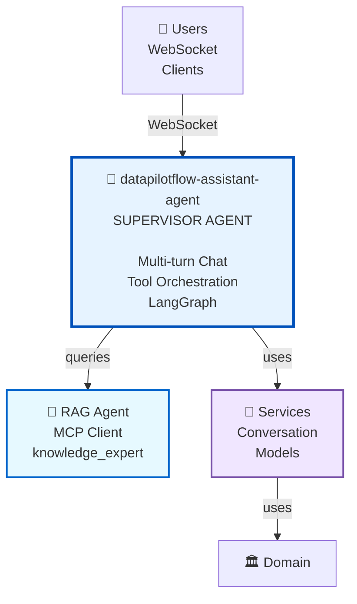

# DataPilotFlow Assistant Agent

**Assistant Agent Package - Supervisor Agent with Tool Orchestration**

The `datapilotflow-assistant-agent` package provides a supervisor/assistant agent that orchestrates multiple tools and agents, including the RAG agent, to handle complex user queries and tasks.

## 🏗️ Architecture Position



**This package provides**:
- Supervisor agent implementation
- Tool orchestration
- Multi-agent coordination
- MCP tool integration
- Conversation management

## 🔑 Key Components

### 1. Assistant Agent

**AssistantAgentService**: Supervisor agent that orchestrates tools and agents

**Responsibilities**:
- Route queries to appropriate agents/tools
- Coordinate multiple agents
- Manage conversation flow
- Integrate with MCP tools (RAG agent)

### 2. Supervisor Graph

**LangGraph Workflow**: Orchestrates agent and tool execution

**Features**:
- Agent routing
- Tool selection
- Multi-step reasoning
- Conversation management

### Uses RAG Agent (via MCP)
```python
# Assistant agent calls RAG agent via MCP
# Uses knowledge_expert tool from RAG MCP server
```

### Uses Services
```python
from datapilotflow.services.conversation import ConversationHistoryService
from datapilotflow.services.model_provider import ModelProviderService

# Assistant agent uses services
conversation_service = ConversationHistoryService()
model_service = ModelProviderService()
```

### Uses Domain
```python
from datapilotflow.domain.config import settings
from datapilotflow.domain.conversation import ConversationMessage

# Assistant agent uses domain models
```

### DataPilotFlow Dependencies
- `datapilotflow-domain>=1.0.0` - Domain models and configuration
- `datapilotflow-infrastructure>=1.0.0` - Database access
- `datapilotflow-services>=1.0.0` - Business logic services

### External Dependencies
- `langgraph>=1.0.2` - Agent workflow orchestration
- `langchain-core>=1.0.0` - LangChain core
- `litellm>=1.79.0` - LLM provider abstraction
- `loguru>=0.7.3` - Logging
- `pydantic>=2.10.6` - Data validation

## 🚀 Installation

```bash
uv pip install -e ../datapilotflow-domain \
  -e ../datapilotflow-infrastructure \
  -e ../datapilotflow-services \
  -e .
```

Or with pip:
```bash
cd datapilotflow-domain && pip install -e .
cd ../datapilotflow-infrastructure && pip install -e .
cd ../datapilotflow-services && pip install -e .
cd ../datapilotflow-assistant-agent && pip install -e .
```

## 📋 Module Capabilities

### 1. **Supervisor Agent**
- Multi-turn conversation management
- Tool and agent orchestration
- Query routing and delegation
- Context preservation

### 2. **Tool Integration**
- MCP tool integration (RAG agent)
- Multiple tool coordination
- Tool output aggregation

### 3. **Conversation Context**
- Message history management
- Context-aware responses
- Multi-user support

## 🔄 Assistant Agent Sequence

```
User Query (WebSocket)
    │
    ▼
Assistant Agent (Supervisor)
    │
    ├→ Analyze Query
    │   │
    │   ├→ Use Knowledge Expert (RAG via MCP)
    │   ├→ Call Tools
    │   └→ Process Results
    │
    ├→ Generate Response
    │   │
    │   └→ Apply Context
    │
    └→ WebSocket Response Stream
        │
        ▼
    User receives response
```

### Build Steps

```bash
uv pip install -e ../datapilotflow-domain \
  -e ../datapilotflow-infrastructure \
  -e ../datapilotflow-services -e .
```

### Using Assistant Agent

The assistant agent is used via the API layer:

```bash
# API server starts assistant agent
python ../datapilotflow-api/run_api_server.py

# Access via WebSocket
ws://localhost:65500/ws/assistant
```

### Integration with RAG Agent

The assistant agent connects to the RAG MCP server:

```python
from datapilotflow.assistant_agent.agent import AssistantAgentService

agent = AssistantAgentService()
response = await agent.process_query(
    query="What is RAG?",
    conversation_id="conv_123",
    use_knowledge_expert=True  # Uses RAG agent
)
```

