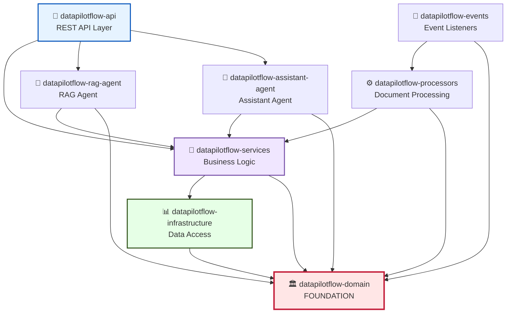

# DataPilotFlow Domain

**Foundation Layer - Core Domain Models and Configuration**

The `datapilotflow-domain` package is the foundational layer of the DataPilotFlow architecture. It contains pure domain models, configuration, and shared utilities with **zero dependencies** on other DataPilotFlow packages.

## 📦 Package Overview

- **Version**: 1.0.0
- **Python**: >=3.11
- **Dependencies**: Minimal (Pydantic, loguru, email-validator)
- **Purpose**: Core domain models, centralized configuration, shared utilities
- **Status**: Stable - Foundation layer, no breaking changes

## 🏗️ Architecture Position

### System Architecture Diagram



**This package is the foundation** - all other DataPilotFlow packages depend on it, but it depends on **nothing** from the DataPilotFlow ecosystem.

## 📁 Package Structure

```
datapilotflow-domain/
├── src/datapilotflow/domain/
│   ├── __init__.py
│   ├── config.py              # Centralized configuration (Settings)
│   ├── logging.py             # Centralized logging utility
│   │
│   ├── agent/                 # Agent domain models
│   │   └── models.py
│   │
│   ├── conversation/          # Conversation domain models
│   │   └── models.py
│   │
│   ├── core/                  # Core exceptions and utilities
│   │   └── exceptions.py
│   │
│   ├── embedding/             # Embedding model definitions
│   │   └── embedding_model.py
│   │
│   ├── events/                # Event definitions and constants
│   │   ├── base.py
│   │   ├── constants.py
│   │   ├── job_events.py
│   │   └── timeline_events.py
│   │
│   ├── generative/            # LLM/generative model definitions
│   │   └── generative_model.py
│   │
│   ├── knowledge/             # Knowledge base domain models
│   │   ├── document_splitter.py
│   │   ├── job_timeline.py
│   │   ├── knowledge_factory.py
│   │   ├── knowledge_job.py
│   │   ├── knowledge_source_config.py
│   │   ├── knowledge.py
│   │   ├── llm_content_filter_config.py
│   │   └── vectordb_collection.py
│   │
│   ├── llm_prompts/           # LLM prompt templates
│   │   ├── ai_responses.py
│   │   ├── base.py
│   │   ├── conversation.py
│   │   └── knowledge_base.py
│   │
│   ├── model_provider/        # Model provider abstractions
│   │   └── model_provider.py
│   │
│   ├── notification/          # Notification domain models
│   │   └── notification.py
│   │
│   ├── rag/                   # RAG-specific domain models
│   │   ├── knowledge_chunk.py
│   │   ├── rag_file_upload.py
│   │   └── weaviate_chunk.py
│   │
│   ├── tool/                  # Tool/MCP server definitions
│   │   └── models.py
│   │
│   ├── user/                  # User and role models
│   │   ├── role_model.py
│   │   ├── roles.py
│   │   └── user.py
│   │
│   └── vectordb/              # Vector database collection models
│       └── collection_models.py
│
├── tests/                     # Unit tests
├── pyproject.toml
└── README.md
```

## 🔑 Key Components

### 1. Configuration (`config.py`)

Centralized application configuration using Pydantic Settings:

- **API Configuration**: Server host, port, WebSocket timeouts
- **MCP Server Configuration**: RAG agent and assistant agent settings
- **MongoDB Configuration**: Connection strings, pool settings
- **Vector Database Configuration**: Milvus connection settings
- **RabbitMQ Configuration**: Message queue settings
- **RAG Configuration**: Top-K, similarity thresholds
- **Agent Tracing**: Observability settings
- **File Paths**: Directory configurations

**Usage**:
```python
from datapilotflow.domain.config import settings

# Access any configuration
api_port = settings.API_SERVER_PORT
mongo_host = settings.MONGO_HOST
vector_db_port = settings.VECTOR_DB_HTTP_PORT
```

### 2. Logging Utility (`logging.py`)

Centralized logging configuration for all services:

**Function**: `setup_service_logging(service_name, ...)`

- Removes existing handlers to prevent cross-contamination
- Sets up console logging (stderr) with INFO level
- Sets up file logging to `logs/{service_name}.log` with DEBUG level
- Consistent formatting across all services
- Automatic daily rotation, 30-day retention, zip compression

**Usage**:
```python
from datapilotflow.domain.logging import setup_service_logging

# In your run script, before any other imports
setup_service_logging("my-service")  # Creates logs/my-service.log

from loguru import logger
logger.info("This goes to logs/my-service.log and stderr")
```

### 3. Domain Models

Pure Pydantic models organized by domain:

- **Agent Models**: Agent configurations and state
- **Conversation Models**: Messages, conversations, history
- **Knowledge Models**: Jobs, sources, documents, chunks, timelines
- **RAG Models**: File uploads, knowledge chunks
- **User Models**: Users, roles, permissions
- **Tool Models**: MCP server and tool definitions
- **Notification Models**: Notification schemas
- **VectorDB Models**: Collection configurations

All models are **pure Pydantic** with no external dependencies.

### 4. Events (`events/`)

Event definitions and constants for the event-driven architecture:

- **Base Events**: Abstract event classes
- **Job Events**: Knowledge job lifecycle events
- **Timeline Events**: Job timeline update events
- **Constants**: Event type constants, routing keys

### 5. LLM Prompts (`llm_prompts/`)

Reusable prompt templates for:
- AI responses
- Conversations
- Knowledge base queries
- Base prompt utilities

## 🔗 How Other Packages Use This Package

### Infrastructure Layer
```python
from datapilotflow.domain.config import settings
from datapilotflow.domain.knowledge import KnowledgeJob
from datapilotflow.domain.user import User

# Uses domain models for database operations
# Uses config for connection settings
```

### Services Layer
```python
from datapilotflow.domain.config import settings
from datapilotflow.domain.knowledge import KnowledgeJob, KnowledgeSource
from datapilotflow.domain.conversation import ConversationMessage

# Uses domain models for business logic
# Uses config for service configuration
```

### API Layer
```python
from datapilotflow.domain.config import settings
from datapilotflow.domain.user import User
from datapilotflow.domain.knowledge import KnowledgeJob

# Uses domain models for request/response validation
# Uses config for API settings
```

### Agents
```python
from datapilotflow.domain.config import settings
from datapilotflow.domain.rag import KnowledgeChunk
from datapilotflow.domain.conversation import ConversationMessage

# Uses domain models for agent state
# Uses config for agent settings
```

## 📦 Dependencies

### External Dependencies
- `pydantic>=2.10.6` - Data validation and settings
- `pydantic-settings>=2.0.0` - Settings management
- `loguru>=0.7.3` - Logging
- `opik>=1.9.11` - Observability/tracing
- `python-dateutil>=2.8.2` - Date utilities
- `email-validator>=2.3.0` - Email validation

### No DataPilotFlow Dependencies
This package has **zero dependencies** on other DataPilotFlow packages, making it the foundation of the entire architecture.

## 📋 Module Capabilities

### 1. **Configuration Management**
- Centralized settings via Pydantic Settings
- Environment variable support (.env files)
- Multi-service configuration (API, MCP, Database, etc.)
- Type-safe configuration access

### 2. **Domain Models**
- **Knowledge**: Jobs, sources, documents, chunks, timelines
- **Conversation**: Messages, conversation history
- **Users & Auth**: Users, roles, permissions, credentials
- **Agents**: Agent states and configurations
- **Notifications**: Notification schemas
- **Tools & MCP**: Tool and MCP server definitions
- **Vector DB**: Collection configurations

### 3. **Event Definitions**
- Job lifecycle events (Created, Started, Completed, Failed)
- Timeline events (Progress tracking)
- Event constants and routing keys
- Base event classes for extensibility

### 4. **Logging Infrastructure**
- Service-specific log files
- Console and file output
- Automatic rotation and compression
- Consistent formatting across all services

### 5. **LLM Prompts**
- Base prompt templates
- Conversation prompts
- Knowledge base query prompts
- AI response formatting

## 🔄 Initialization Sequence Diagram

```
┌─────────────────┐
│  Any Package    │
└────────┬────────┘
         │
         │ import config
         ├──────────────────────────┐
         │                          ▼
         │               ┌──────────────────────┐
         │               │ Pydantic Settings    │
         │               │ loads .env file      │
         │               │ validates types      │
         │               │ provides defaults    │
         │               └──────────────────────┘
         │
         │ setup_service_logging()
         ├──────────────────────────┐
         │                          ▼
         │               ┌──────────────────────┐
         │               │ Remove existing      │
         │               │ handlers             │
         │               └──────────────────────┘
         │                          │
         │                          ▼
         │               ┌──────────────────────┐
         │               │ Configure loguru:    │
         │               │ • Console (stderr)   │
         │               │ • File (logs/*.log)  │
         │               │ • Rotation/Compress  │
         │               └──────────────────────┘
         │
         ▼
   Ready to use domain models and logging
```

## 🚀 Installation & Setup

### Prerequisites
- Python >=3.11
- UV package manager (recommended)
  ```bash
  pip install uv
  ```

### Install from Source

```bash
uv pip install -e .
```

Or with pip:
```bash
pip install -e .
```

### Verify Installation

```bash
python -c "from datapilotflow.domain.config import settings; print(f'✓ Config loaded: {settings.API_SERVER_HOST}:{settings.API_SERVER_PORT}')"
```


## 🧪 Testing

```bash
cd datapilotflow-domain
pytest tests/
```

## 📚 Related Packages

This package is used by:
- ✅ `datapilotflow-infrastructure` - Uses config and domain models
- ✅ `datapilotflow-services` - Uses config and domain models
- ✅ `datapilotflow-processors` - Uses domain models
- ✅ `datapilotflow-events` - Uses event definitions
- ✅ `datapilotflow-api` - Uses config and domain models
- ✅ `datapilotflow-rag-agent` - Uses config and domain models
- ✅ `datapilotflow-assistant-agent` - Uses config and domain models

## 🎯 Design Principles

1. **Pure Domain Logic**: No infrastructure concerns, no framework dependencies
2. **Pydantic Models**: Type-safe, validated data structures
3. **Configuration Centralization**: Single source of truth for all settings
4. **Zero Coupling**: No dependencies on other DataPilotFlow packages
5. **Reusability**: Models and utilities usable across all layers

## 🛠️ How to Build & Start

### Build Steps

1. **Navigate to module**
   ```bash
   cd datapilotflow-domain
   ```

2. **Install dependencies**
   ```bash
   # Using pip
   pip install -e .

   # Or using uv (faster)
   uv pip install -e .
   ```

3. **Verify installation**
   ```bash
   python -m pytest tests/  # Run tests
   ```

4. **Configure environment** (optional)
   ```bash
   # Copy example env if provided
   cp .env.example .env

   # Edit with your settings
   vim .env
   ```

### Development Setup

```bash
# Create development virtual environment
python -m venv venv
source venv/bin/activate  # On Windows: venv\Scripts\activate

# Install in development mode with test dependencies
pip install -e ".[dev]"

# Run tests
pytest tests/ -v

# Run type checking
pyright .
```

### Standalone Usage

```bash
# Once installed, use directly in Python
python -c "
from datapilotflow.domain.config import settings
from datapilotflow.domain.logging import setup_service_logging

# Setup logging
setup_service_logging('my-app')

# Access configuration
print(f'Database: {settings.MONGO_CONN_STR}')
print(f'Vector DB: {settings.VECTOR_DB_HOST}:{settings.VECTOR_DB_HTTP_PORT}')
"
```

## 📖 Documentation

For more details on specific components:
- **Configuration**: See [src/datapilotflow/domain/config.py](src/datapilotflow/domain/config.py)
- **Logging**: See [src/datapilotflow/domain/logging.py](src/datapilotflow/domain/logging.py)
- **Domain Models**: See [src/datapilotflow/domain/](src/datapilotflow/domain/) subdirectories
- **Event Definitions**: See [src/datapilotflow/domain/events/](src/datapilotflow/domain/events/)
- **LLM Prompts**: See [src/datapilotflow/domain/llm_prompts/](src/datapilotflow/domain/llm_prompts/)
