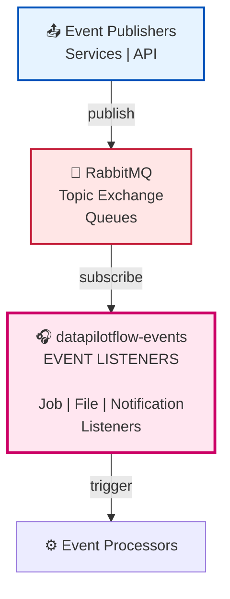

# DataPilotFlow Events

**Event-Driven Layer - RabbitMQ Event Publishing and Listening**

The `datapilotflow-events` package provides event-driven architecture capabilities using RabbitMQ. It handles event publishing, listening, and routing for asynchronous processing across the system.


## 🏗️ Architecture Position



**This package provides**:
- Event listener base classes
- Event routing and handling
- Async event processing
- Event-driven job processing


## 🚀 Installation

```bash
uv pip install -e ../datapilotflow-domain \
  -e ../datapilotflow-infrastructure \
  -e ../datapilotflow-services \
  -e ../datapilotflow-processors \
  -e .
```

Or with pip:
```bash
cd datapilotflow-domain && pip install -e .
cd ../datapilotflow-infrastructure && pip install -e .
cd ../datapilotflow-services && pip install -e .
cd ../datapilotflow-processors && pip install -e .
cd ../datapilotflow-events && pip install -e .
```

## 🔧 Configuration

Events use configuration from `datapilotflow-domain`:

```python
from datapilotflow.domain.config import settings

# RabbitMQ Configuration
RABBITMQ_HOST = settings.RABBITMQ_HOST
RABBITMQ_PORT = settings.RABBITMQ_PORT
RABBITMQ_USER = settings.RABBITMQ_USER
RABBITMQ_PASS = settings.RABBITMQ_PASS
RABBITMQ_VHOST = settings.RABBITMQ_VHOST
```

## 📋 Module Capabilities

### 1. **Job Event Listener**
- Listen for knowledge job events
- Trigger job processing
- Handle job status updates
- Track job lifecycle

### 2. **File Upload Event Listener**
- Monitor file uploads
- Trigger file processing
- Track upload progress
- Handle upload failures

### 3. **Notification Event Listener**
- Handle notification creation
- Route notifications to users
- WebSocket delivery
- Notification persistence

## 🔄 Event Processing Sequence

```
Service publishes event
         │
         ▼
RabbitMQ Topic Exchange
         │
         ▼
Event Queue (routed by routing key)
         │
         ▼
Event Listener (separate process)
         │
    ┌────┼────┐
    │         │
    ▼         ▼
Success    Error/DLQ
    │         │
    ├─→ Event Processor
    │         │
    │         ▼
    │    Update via Services
    │         │
    └─────────┴──→ Callback/Response
```

## 🛠️ How to Build & Start

### Build Steps

```bash
uv pip install -e ../datapilotflow-domain \
  -e ../datapilotflow-infrastructure \
  -e ../datapilotflow-services \
  -e ../datapilotflow-processors -e .
```

### Start Event Listeners

```bash
# Start all listeners
python run_all_event_listeners.py

# Or start individual listeners
python run_job_event_listener.py &
python run_file_upload_event_listener.py &
python run_notification_event_listener.py &
```

### Monitor Event Processing

```bash
# Watch logs in real-time
tail -f logs/job-event-listener.log
tail -f logs/file-upload-event-listener.log
tail -f logs/notification-event-listener.log
```
