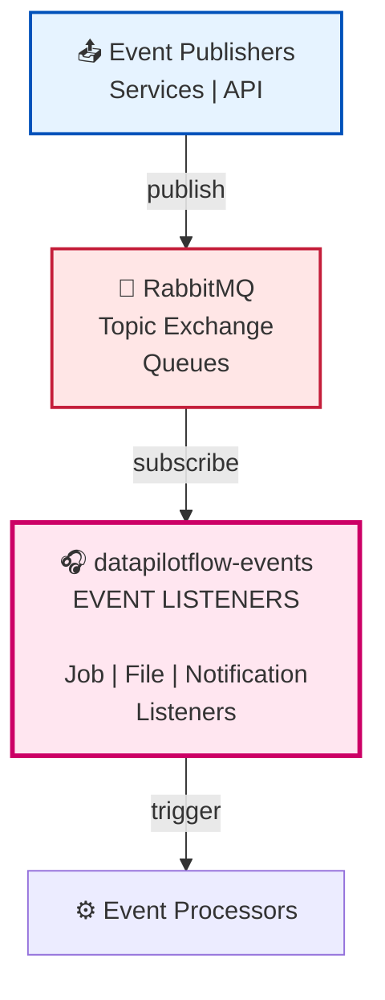

# DataPilotFlow Events

**Event-Driven Layer - RabbitMQ Event Publishing and Listening**

The `datapilotflow-events` package provides event-driven architecture capabilities using RabbitMQ. It handles event publishing, listening, and routing for asynchronous processing across the system.

## 📦 Package Overview

- **Version**: 1.0.0
- **Python**: >=3.11
- **Dependencies**: `datapilotflow-domain` + RabbitMQ client
- **Purpose**: Event-driven messaging, event listeners, and async processing

## 🏗️ Architecture Position



**This package provides**:
- Event listener base classes
- Event routing and handling
- Async event processing
- Event-driven job processing

## 📁 Package Structure

```
datapilotflow-events/
├── src/datapilotflow/events/
│   ├── __init__.py
│   │
│   ├── events_listeners/         # Event listeners
│   │   ├── base_event_listener.py
│   │   ├── file_upload_event_listener.py
│   │   ├── job_event_listener.py
│   │   └── notification_event_listener.py
│   │
│   └── config.py                 # Event configuration
│
├── run_all_event_listeners.py    # Run all listeners
├── run_file_upload_event_listener.py
├── run_job_event_listener.py
├── run_notification_event_listener.py
│
├── tests/
├── pyproject.toml
└── README.md
```

## 🔑 Key Components

### 1. Base Event Listener

**BaseEventListener**: Abstract base class for all event listeners

**Features**:
- Automatic connection management
- Error handling and retry logic
- Graceful shutdown
- Event routing

**Usage**:
```python
from datapilotflow.events.events_listeners import BaseEventListener

class MyEventListener(BaseEventListener):
    async def handle_event(self, event_data: dict):
        # Process event
        await self.process_event(event_data)
    
    async def process_event(self, event_data: dict):
        # Your event processing logic
        pass
```

### 2. Job Event Listener

**JobEventListener**: Listens for knowledge job events

**Handles**:
- Job created events
- Job status update events
- Job completion events
- Job failure events

**Usage**:
```python
from datapilotflow.events.events_listeners import start_job_event_listener

# Start job event listener
await start_job_event_listener()
```

### 3. File Upload Event Listener

**FileUploadEventListener**: Listens for file upload events

**Handles**:
- File uploaded events
- File processing events
- File upload failures

**Usage**:
```python
from datapilotflow.events.events_listeners import start_file_upload_event_listener

# Start file upload event listener
await start_file_upload_event_listener()
```

### 4. Notification Event Listener

**NotificationEventListener**: Listens for notification events

**Handles**:
- Notification created events
- Notification delivery events

**Usage**:
```python
from datapilotflow.events.events_listeners import start_notification_event_listener

# Start notification event listener
await start_notification_event_listener()
```

## 🔗 How This Package Uses Lower Layers

### Uses Domain
```python
from datapilotflow.domain.events import (
    JobCreatedEvent,
    JobStatusUpdatedEvent,
    EventType
)
from datapilotflow.domain.config import settings
from datapilotflow.domain.logging import setup_service_logging

# Events use domain event definitions
event = JobCreatedEvent(job_id="123", ...)

# Use domain config
rabbitmq_host = settings.RABBITMQ_HOST

# Use domain logging
setup_service_logging("job-event-listener")
```

### Uses Infrastructure
```python
from datapilotflow.infrastructure.mq.client import (
    RabbitMQClient,
    get_rabbitmq_client
)

# Events use RabbitMQ client
connection = await get_rabbitmq_client()
client = RabbitMQClient(connection)
```

### Uses Processors
```python
from datapilotflow.processors.knowledge_job import KnowledgeJobEventProcessor

# Event listeners trigger processors
processor = KnowledgeJobEventProcessor()
await processor.process_job_created_event(event_data)
```

### Uses Services
```python
from datapilotflow.services.knowledge import KnowledgeJobService
from datapilotflow.services.events_publisher import JobEventPublisher

# Event listeners use services
job_service = KnowledgeJobService()
event_publisher = JobEventPublisher()
```

## 🔗 How Other Packages Use This Package

### Services Layer (Publishes Events)
```python
from datapilotflow.services.events_publisher import JobEventPublisher

# Services publish events
publisher = JobEventPublisher()
await publisher.publish_job_created(job_id, job_data)
```

### API Layer (Can Publish Events)
```python
from datapilotflow.services.events_publisher import JobEventPublisher

# API can publish events through services
# (API → Services → Event Publisher)
```

## 📦 Dependencies

### DataPilotFlow Dependencies
- `datapilotflow-domain>=1.0.0` - Event definitions and configuration

### External Dependencies
- `aio-pika>=9.5.5` - RabbitMQ async client
- `pydantic>=2.10.6` - Data validation
- `pydantic-settings>=2.7.1` - Settings management
- `loguru>=0.7.3` - Logging

## 🚀 Installation

```bash
uv pip install -e ../datapilotflow-domain \
  -e ../datapilotflow-infrastructure \
  -e ../datapilotflow-services \
  -e ../datapilotflow-processors \
  -e .
```

Or with pip:
```bash
cd datapilotflow-domain && pip install -e .
cd ../datapilotflow-infrastructure && pip install -e .
cd ../datapilotflow-services && pip install -e .
cd ../datapilotflow-processors && pip install -e .
cd ../datapilotflow-events && pip install -e .
```


## 🧪 Testing

```bash
cd datapilotflow-events
pytest tests/
```

**Test Requirements**:
- RabbitMQ instance (or test container)

## 📚 Related Packages

**Depends on**:
- ✅ `datapilotflow-domain` - Uses event definitions and config

**Used by**:
- ✅ `datapilotflow-processors` - Triggered by events
- ✅ `datapilotflow-services` - Publishes events

## 🎯 Design Principles

1. **Event-Driven**: Asynchronous event processing
2. **Separation of Concerns**: Listeners separate from processors
3. **Error Handling**: Robust error handling and retry logic
4. **Graceful Shutdown**: Clean shutdown handling
5. **Service-Specific Logging**: Each listener has its own log file

## 🔧 Configuration

Events use configuration from `datapilotflow-domain`:

```python
from datapilotflow.domain.config import settings

# RabbitMQ Configuration
RABBITMQ_HOST = settings.RABBITMQ_HOST
RABBITMQ_PORT = settings.RABBITMQ_PORT
RABBITMQ_USER = settings.RABBITMQ_USER
RABBITMQ_PASS = settings.RABBITMQ_PASS
RABBITMQ_VHOST = settings.RABBITMQ_VHOST
```

## 📋 Module Capabilities

### 1. **Job Event Listener**
- Listen for knowledge job events
- Trigger job processing
- Handle job status updates
- Track job lifecycle

### 2. **File Upload Event Listener**
- Monitor file uploads
- Trigger file processing
- Track upload progress
- Handle upload failures

### 3. **Notification Event Listener**
- Handle notification creation
- Route notifications to users
- WebSocket delivery
- Notification persistence

## 🔄 Event Processing Sequence

```
Service publishes event
         │
         ▼
RabbitMQ Topic Exchange
         │
         ▼
Event Queue (routed by routing key)
         │
         ▼
Event Listener (separate process)
         │
    ┌────┼────┐
    │         │
    ▼         ▼
Success    Error/DLQ
    │         │
    ├─→ Event Processor
    │         │
    │         ▼
    │    Update via Services
    │         │
    └─────────┴──→ Callback/Response
```

## 🛠️ How to Build & Start

### Build Steps

```bash
uv pip install -e ../datapilotflow-domain \
  -e ../datapilotflow-infrastructure \
  -e ../datapilotflow-services \
  -e ../datapilotflow-processors -e .
```

### Start Event Listeners

```bash
# Start all listeners
python run_all_event_listeners.py

# Or start individual listeners
python run_job_event_listener.py &
python run_file_upload_event_listener.py &
python run_notification_event_listener.py &
```

### Monitor Event Processing

```bash
# Watch logs in real-time
tail -f logs/job-event-listener.log
tail -f logs/file-upload-event-listener.log
tail -f logs/notification-event-listener.log
```

## 📖 Documentation

For more details:
- **Event Listeners**: See [src/datapilotflow/events/events_listeners/](src/datapilotflow/events/events_listeners/)
- **Event Configuration**: See [src/datapilotflow/events/config.py](src/datapilotflow/events/config.py)
- **Run Scripts**: See [run_*.py](./)
