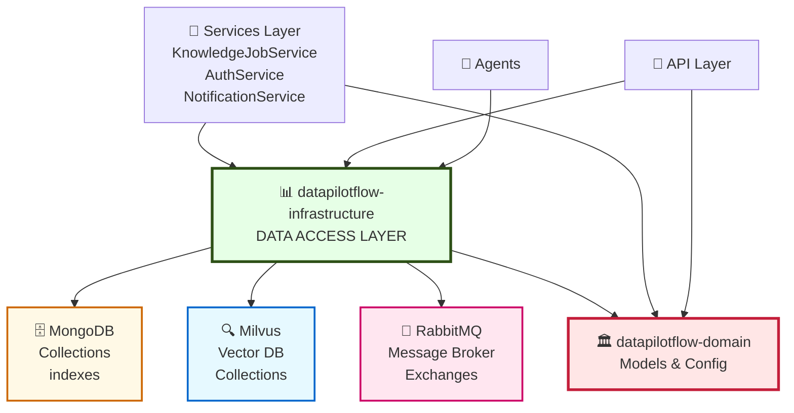

# DataPilotFlow Infrastructure

**Infrastructure Layer - Database Access and External System Integration**

The `datapilotflow-infrastructure` package provides data access objects (DAOs), database clients, and infrastructure abstractions. It sits directly above the domain layer and provides concrete implementations for data persistence and system integration.

## 📦 Package Overview

- **Version**: 1.0.0
- **Python**: >=3.11
- **Dependencies**: `datapilotflow-domain` + database drivers (PyMongo, PyMilvus, aio-pika)
- **Purpose**: Database access, message queues, infrastructure clients
- **Status**: Stable - Data layer isolation from business logic

## 🏗️ Architecture Position

### System Architecture Diagram



**This package provides**:
- MongoDB client with connection pooling
- Milvus vector database client with collection management
- RabbitMQ async message queue client
- Data Access Objects (DAOs) for all domain entities
- Database schema and index management

## 📁 Package Structure

```
datapilotflow-infrastructure/
├── src/datapilotflow/infrastructure/
│   ├── __init__.py
│   │
│   ├── mongo/                    # MongoDB infrastructure
│   │   ├── client.py            # MongoClientWrapper (singleton)
│   │   └── indexes.py           # Database indexes
│   │
│   ├── mq/                       # Message Queue (RabbitMQ)
│   │   ├── client.py            # RabbitMQClient (singleton)
│   │   └── __init__.py
│   │
│   ├── vectordb/                 # Vector Database (Milvus)
│   │   ├── milvus/
│   │   │   ├── client.py        # MilvusClientWrapper
│   │   │   ├── indexes.py       # Vector indexes
│   │   │   ├── utils.py         # Utility functions
│   │   │   └── examples.py      # Usage examples
│   │   └── processor.py         # Vector processing utilities
│   │
│   └── dao/                      # Data Access Objects (organized by domain)
│       ├── __init__.py
│       │
│       ├── auth/                 # Authentication & Authorization
│       │   ├── auth_dao.py      # User authentication DAO
│       │   └── roles_dao.py     # Roles and permissions DAO
│       │
│       ├── file_management/     # File upload management
│       │   └── rag_file_upload_service.py
│       │
│       ├── knowledge/            # Knowledge base DAOs
│       │   ├── document_splitter_dao.py
│       │   ├── job_timeline_dao.py
│       │   ├── knowledge_job_dao.py
│       │   ├── knowledge_source_dao.py
│       │   ├── llm_content_filter_dao.py
│       │   └── url_source_dao.py
│       │
│       ├── model_provider/       # Model provider DAO
│       │   └── model_provider_dao.py
│       │
│       ├── notification/         # Notification DAO
│       │   └── notification_service.py
│       │
│       ├── tool/                 # Tool & MCP server DAOs
│       │   ├── mcp_server_dao.py
│       │   └── tool_dao.py
│       │
│       └── vectordb/            # Vector database collection DAO
│           └── vectordb_collection_dao.py
│
├── tests/
├── pyproject.toml
└── README.md
```

## 🔑 Key Components

### 1. MongoDB Client (`mongo/client.py`)

Singleton MongoDB client wrapper with connection pooling:

**Features**:
- Thread-safe singleton pattern
- Connection pooling configuration
- Automatic reconnection handling
- Index management

**Usage**:
```python
from datapilotflow.infrastructure.mongo.client import (
    MongoClientWrapper,
    get_mongo_client,
    close_mongo_client
)

# Get singleton client
client = await get_mongo_client()

# Access database
db = client.get_database("datapilotflow")
collection = db.get_collection("knowledge_jobs")

# Cleanup (on shutdown)
await close_mongo_client()
```

### 2. Vector Database Client (`vectordb/milvus/client.py`)

Milvus vector database client wrapper:

**Features**:
- Generic type support for different collection types
- Collection management (create, delete, list)
- Vector search operations
- Index management

**Usage**:
```python
from datapilotflow.infrastructure.vectordb.milvus.client import (
    MilvusClientWrapper
)

# Initialize client
client = MilvusClientWrapper()

# Create collection
await client.create_collection(
    collection_name="my_collection",
    dimension=1536,
    description="My vector collection"
)

# Search vectors
results = await client.search(
    collection_name="my_collection",
    query_vectors=[[0.1, 0.2, ...]],
    top_k=5
)
```

### 3. RabbitMQ Client (`mq/client.py`)

RabbitMQ message queue client with connection pooling:

**Features**:
- Async message publishing
- Message consumption with callbacks
- Exchange and queue declaration
- Connection pooling

**Usage**:
```python
from datapilotflow.infrastructure.mq.client import (
    RabbitMQClient,
    get_rabbitmq_client,
    close_rabbitmq_client
)

# Get singleton client
connection = await get_rabbitmq_client()

# Declare exchange and queue
client = RabbitMQClient(connection)
exchange = await client.declare_exchange("events", "topic")
queue = await client.declare_queue("job_events")

# Publish message
await client.publish_message(
    exchange=exchange,
    routing_key="job.created",
    message={"job_id": "123", "status": "pending"}
)

# Consume messages
await client.consume_messages(
    queue=queue,
    callback=handle_message
)
```

### 4. Data Access Objects (DAOs)

Organized by domain, each DAO provides CRUD operations for domain entities:

**Knowledge DAOs**:
```python
from datapilotflow.infrastructure.dao.knowledge import (
    KnowledgeJobDAO,
    KnowledgeSourceDAO,
    JobTimelineDAO,
    DocumentSplitterDAO,
    UrlSourceDAO,
    LLMContentFilterDAO
)

# Create DAO instance
job_dao = KnowledgeJobDAO()

# CRUD operations
job = await job_dao.create(knowledge_job)
job = await job_dao.get_by_id(job_id)
jobs = await job_dao.get_all()
await job_dao.update(job_id, updates)
await job_dao.delete(job_id)
```

**Auth DAOs**:
```python
from datapilotflow.infrastructure.dao.auth import (
    AuthDAO,
    RolesDAO
)

auth_dao = AuthDAO()
user = await auth_dao.authenticate(email, password)
```

**Other DAOs**:
- `ModelProviderDAO` - Model provider management
- `VectorDBCollectionDAO` - Vector collection management
- `NotificationService` - Notification persistence
- `ToolDAO`, `MCPServerDAO` - Tool and MCP server management

## 🔗 How This Package Uses Domain

### Configuration
```python
from datapilotflow.domain.config import settings

# Use domain config for connection settings
mongo_conn_str = settings.MONGO_CONN_STR
vector_db_host = settings.VECTOR_DB_HOST
rabbitmq_host = settings.RABBITMQ_HOST
```

### Domain Models
```python
from datapilotflow.domain.knowledge import KnowledgeJob, KnowledgeSource
from datapilotflow.domain.user import User
from datapilotflow.domain.vectordb import VectorDBCollection

# DAOs work with domain models
job = KnowledgeJob(name="My Job", ...)
await job_dao.create(job)  # Persist domain model
```

### Logging
```python
from datapilotflow.domain.logging import setup_service_logging

# Use domain logging utility
setup_service_logging("infrastructure")
```

## 🔗 How Other Packages Use This Package

### Services Layer
```python
from datapilotflow.infrastructure.dao.knowledge import KnowledgeJobDAO
from datapilotflow.infrastructure.mongo.client import get_mongo_client
from datapilotflow.infrastructure.vectordb.milvus.client import MilvusClientWrapper

# Services use DAOs for data access
class KnowledgeJobService:
    def __init__(self):
        self.job_dao = KnowledgeJobDAO()
    
    async def create_job(self, job_data):
        job = await self.job_dao.create(job_data)
        return job
```

### Processors Layer
```python
from datapilotflow.infrastructure.vectordb.milvus.client import MilvusClientWrapper

# Processors use infrastructure for vector operations
client = MilvusClientWrapper()
await client.insert_vectors(collection_name, vectors)
```

### Events Layer
```python
from datapilotflow.infrastructure.mq.client import RabbitMQClient

# Events use RabbitMQ for message publishing
client = RabbitMQClient(connection)
await client.publish_message(exchange, routing_key, message)
```

### API Layer
```python
from datapilotflow.infrastructure.dao.knowledge import KnowledgeJobDAO

# API uses DAOs through services
# (API → Services → Infrastructure)
```

## 📋 Module Capabilities

### 1. **MongoDB Client & DAOs**
- Singleton connection pooling
- Automatic reconnection handling
- Index creation and management
- Bulk operations support
- CRUD operations for all entities
- Query flexibility with MongoDB operators

### 2. **Milvus Vector Database Client**
- Collection creation and management
- Vector insertion with IDs
- Similarity search (top-k retrieval)
- Index creation (IVF_FLAT, HNSW, etc.)
- Batch operations
- Generic type support for different data types

### 3. **RabbitMQ Message Queue Client**
- Async message publishing
- Message consumption with callbacks
- Exchange and queue management
- Topic-based routing
- Connection pooling
- Error handling and retry logic

### 4. **Data Access Objects (DAOs)**
- **Knowledge**: Jobs, sources, documents, chunks, timelines, filters
- **Auth**: Users, roles, permissions
- **Vectors**: Collection management
- **Notifications**: Notification persistence
- **Tools**: MCP servers and tool definitions
- **Files**: File upload tracking

## 🔄 Data Access Sequence Diagram

```
┌─────────────────────────────────────────────────────────────┐
│              Service Layer                                   │
│  (KnowledgeJobService, etc.)                                │
└────────────┬────────────────────────────────────────────────┘
             │ calls
             ├──────────────────────────────────────┐
             │                                      │
    ┌────────▼──────────────┐       ┌──────────────▼─────────┐
    │ Knowledge DAOs        │       │ Vector DB Client       │
    │ (CRUD operations)     │       │ (Search, Insert, etc.) │
    └────────┬──────────────┘       └──────────────┬─────────┘
             │                                    │
             │ uses                               │ uses
             ▼                                    ▼
    ┌─────────────────────────────────────────────────────────┐
    │       MongoDB Client (Singleton)                        │
    │  • Connection Pool                                      │
    │  • Session Management                                   │
    │  • Automatic Reconnect                                  │
    └────────┬────────────────────────────────────────────────┘
             │
             ▼
    ┌─────────────────────────────────────────────────────────┐
    │       MongoDB Database                                   │
    │  Collections: jobs, sources, users, documents, etc.     │
    └─────────────────────────────────────────────────────────┘

    Parallel:
    ┌─────────────────────────────────────────────────────────┐
    │       Milvus Vector Database                            │
    │  Collections: embeddings, chunks, etc.                  │
    └─────────────────────────────────────────────────────────┘

    Message Queue:
    ┌─────────────────────────────────────────────────────────┐
    │       RabbitMQ Message Broker                           │
    │  Exchanges: events (topic)                              │
    │  Queues: job_events, file_events, notifications         │
    └─────────────────────────────────────────────────────────┘
```

## 📦 Dependencies

### DataPilotFlow Dependencies
- `datapilotflow-domain>=1.0.0` - Domain models and configuration

### External Dependencies
- `pymongo>=4.9.2` - MongoDB async driver
- `pymilvus>=2.6.5` - Milvus vector database client
- `sentence-transformers>=5.2.0` - Embedding models
- `aio-pika>=9.3.0` - RabbitMQ async client
- `pydantic>=2.10.6` - Data validation
- `loguru>=0.7.3` - Logging

## 🚀 Installation

### Prerequisites
- Python >=3.11
- UV package manager (recommended)
  ```bash
  pip install uv
  ```
- MongoDB instance running (or will connect on demand)
- Milvus instance running (or will connect on demand)
- RabbitMQ instance running (or will connect on demand)

### Install from Source

```bash
uv pip install -e ../datapilotflow-domain \
  -e .
```

Or with pip:
```bash
cd datapilotflow-domain && pip install -e .
cd ../datapilotflow-infrastructure && pip install -e .
```

### Verify Installation

```bash
python -c "
from datapilotflow.infrastructure.mongo.client import MongoClientWrapper
from datapilotflow.infrastructure.vectordb.milvus.client import MilvusClientWrapper
print('✓ MongoDB client imported')
print('✓ Milvus client imported')
"
```


## 🧪 Testing

```bash
cd datapilotflow-infrastructure
pytest tests/
```

**Test Requirements**:
- MongoDB instance (or test container)
- Milvus instance (or test container)
- RabbitMQ instance (or test container)

## 📚 Related Packages

**Depends on**:
- ✅ `datapilotflow-domain` - Uses config and domain models

**Used by**:
- ✅ `datapilotflow-services` - Uses DAOs and clients
- ✅ `datapilotflow-processors` - Uses vector DB client
- ✅ `datapilotflow-events` - Uses RabbitMQ client
- ✅ `datapilotflow-api` - Uses through services layer
- ✅ `datapilotflow-rag-agent` - Uses vector DB client
- ✅ `datapilotflow-assistant-agent` - Uses infrastructure clients

## 🎯 Design Principles

1. **Separation of Concerns**: Infrastructure separate from business logic
2. **DAO Pattern**: Data access objects for each domain entity
3. **Singleton Clients**: Shared connection pools for efficiency
4. **Domain Model Usage**: Works with domain models, not raw data
5. **Async/Await**: All operations are async for performance

## 🔧 Configuration

Infrastructure uses configuration from `datapilotflow-domain`:

```python
from datapilotflow.domain.config import settings

# MongoDB
MONGO_HOST = settings.MONGO_HOST
MONGO_PORT = settings.MONGO_PORT
MONGO_DB_NAME = settings.MONGO_DB_NAME

# Vector DB
VECTOR_DB_HOST = settings.VECTOR_DB_HOST
VECTOR_DB_HTTP_PORT = settings.VECTOR_DB_HTTP_PORT

# RabbitMQ
RABBITMQ_HOST = settings.RABBITMQ_HOST
RABBITMQ_PORT = settings.RABBITMQ_PORT
```

## 🛠️ How to Build & Start

### Build Steps

1. **Install dependencies first**
   ```bash
   cd ../datapilotflow-domain
   pip install -e .
   ```

2. **Navigate to infrastructure module**
   ```bash
   cd ../datapilotflow-infrastructure
   ```

3. **Install infrastructure**
   ```bash
   pip install -e .
   ```

4. **Verify installation**
   ```bash
   python -m pytest tests/
   ```

5. **Configure infrastructure** (optional)
   ```bash
   # Create .env file with your settings
   cat > .env << EOF
   MONGO_CONN_STR=mongodb://localhost:27017
   MONGO_DB_NAME=datapilotflow
   VECTOR_DB_HOST=localhost
   VECTOR_DB_HTTP_PORT=19530
   RABBITMQ_HOST=localhost
   RABBITMQ_PORT=5672
   EOF
   ```

### Development Setup

```bash
# Create development virtual environment
python -m venv venv
source venv/bin/activate  # On Windows: venv\Scripts\activate

# Install in development mode
pip install -e ".[dev]"

# Run tests
pytest tests/ -v

# Run type checking
pyright .
```

### Starting with Docker (Recommended for Development)

```bash
# Start all infrastructure services
cd ../../docker
docker-compose up -d mongodb milvus rabbitmq

# Verify services are running
docker-compose logs

# View service ports:
# - MongoDB: localhost:27017
# - Milvus: localhost:19530 (HTTP), localhost:19121 (gRPC)
# - RabbitMQ: localhost:5672 (AMQP), localhost:15672 (Management UI)
```

### Verify Infrastructure Connection

```bash
python << 'EOF'
import asyncio
from datapilotflow.infrastructure.mongo.client import get_mongo_client, close_mongo_client
from datapilotflow.infrastructure.vectordb.milvus.client import MilvusClientWrapper

async def verify():
    # Test MongoDB
    try:
        client = await get_mongo_client()
        print("✓ MongoDB connected")
        await close_mongo_client()
    except Exception as e:
        print(f"✗ MongoDB error: {e}")

    # Test Milvus
    try:
        client = MilvusClientWrapper()
        print("✓ Milvus client created")
    except Exception as e:
        print(f"✗ Milvus error: {e}")

asyncio.run(verify())
EOF
```

## 📖 Documentation

For more details on specific components:
- **MongoDB Client**: See [src/datapilotflow/infrastructure/mongo/client.py](src/datapilotflow/infrastructure/mongo/client.py)
- **Vector DB Client**: See [src/datapilotflow/infrastructure/vectordb/milvus/client.py](src/datapilotflow/infrastructure/vectordb/milvus/client.py)
- **RabbitMQ Client**: See [src/datapilotflow/infrastructure/mq/client.py](src/datapilotflow/infrastructure/mq/client.py)
- **DAOs**: See [src/datapilotflow/infrastructure/dao/](src/datapilotflow/infrastructure/dao/)
- **Indexes**: See [src/datapilotflow/infrastructure/mongo/indexes.py](src/datapilotflow/infrastructure/mongo/indexes.py)
