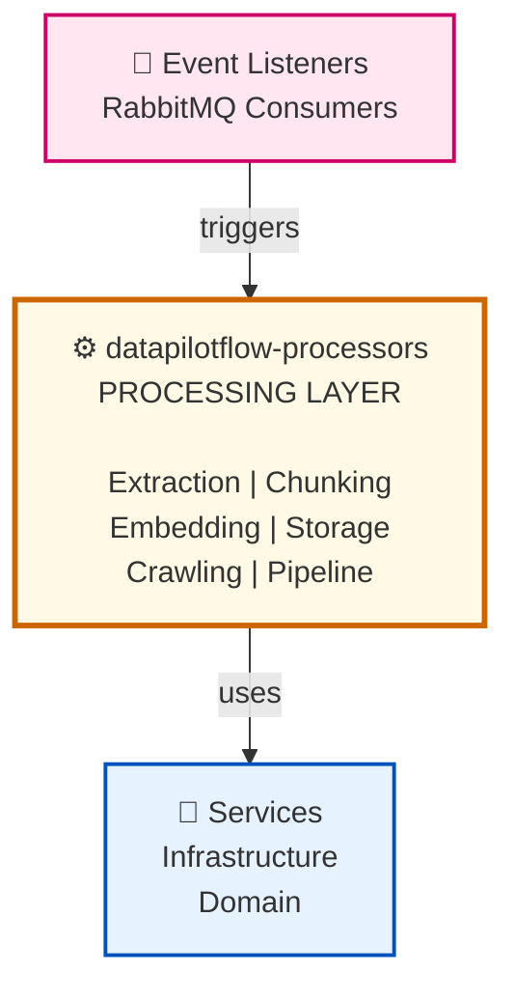

# DataPilotFlow Processors

**Document Processing Layer - Text Splitting, Extraction, and Web Crawling**

The `datapilotflow-processors` package provides document processing capabilities including text extraction, chunking, web crawling, and file processing. It processes events from the events layer and orchestrates the knowledge ingestion pipeline.

## 🏗️ Architecture Position



**This package provides**:
- Document extraction (PDF, HTML, web pages)
- Text splitting and chunking
- Web crawling
- Knowledge ingestion pipeline orchestration
- File upload processing

## 🔑 Key Components

### 1. Knowledge Job Processor

**KnowledgeJobProcessor**: Main orchestrator for knowledge ingestion jobs

**Pipeline Steps**:
1. **File Extraction**: Extract content from files
2. **Extraction**: Extract text from web pages/URLs
3. **Chunking**: Split documents into chunks
4. **Embedding**: Generate embeddings for chunks
5. **Storage**: Store vectors in Milvus
6. **Timeline**: Update job timeline

**Usage**:
```python
from datapilotflow.processors.knowledge_job import KnowledgeJobProcessor

processor = KnowledgeJobProcessor()

# Process knowledge job
await processor.process_job(
    job_id="job_123",
    source_id="source_456",
    config={...}
)
```

### 2. Document Processors

**FileProcessor**: Processes uploaded files (PDF, DOCX, etc.)
```python
from datapilotflow.processors.document import FileProcessor

processor = FileProcessor()

# Extract text from file
content = await processor.extract(file_path)
```

**WebDocumentProcessor**: Processes web pages
```python
from datapilotflow.processors.document import WebDocumentProcessor

processor = WebDocumentProcessor()

# Extract content from URL
content = await processor.extract(url)
```

### 3. Text Splitters

**TextSplitter**: Splits text into chunks
```python
from datapilotflow.processors.splitters import TextSplitter

splitter = TextSplitter(
    chunk_size=1000,
    chunk_overlap=200
)

# Split text
chunks = splitter.split_text(text)
```

**HTMLSplitter**: Splits HTML content
```python
from datapilotflow.processors.splitters import HTMLSplitter

splitter = HTMLSplitter()
chunks = splitter.split_html(html_content)
```

### 4. Web Crawler

**CrawlerProcessor**: Crawls websites
```python
from datapilotflow.processors.crawler import CrawlerProcessor

crawler = CrawlerProcessor()

# Crawl website
results = await crawler.crawl(
    urls=["https://example.com"],
    max_depth=3,
    config={...}
)
```

### 5. Pipeline Orchestration

**JobOrchestrator**: Orchestrates the knowledge ingestion pipeline
```python
from datapilotflow.processors.knowledge_job.orchestration import JobOrchestrator

orchestrator = JobOrchestrator()

# Execute pipeline
await orchestrator.execute_pipeline(
    job_id=job_id,
    pipeline_config={...}
)
```

### Uses Services
```python
from datapilotflow.services.knowledge import (
    KnowledgeJobService,
    KnowledgeIngestionService
)
from datapilotflow.services.events_publisher import JobEventPublisher

# Processors use services for business logic
job_service = KnowledgeJobService()
ingestion_service = KnowledgeIngestionService()
event_publisher = JobEventPublisher()
```

### Uses Infrastructure
```python
from datapilotflow.infrastructure.vectordb.milvus.client import MilvusClientWrapper
from datapilotflow.infrastructure.dao.knowledge import KnowledgeJobDAO

# Processors use infrastructure for data access
vector_client = MilvusClientWrapper()
job_dao = KnowledgeJobDAO()
```

### Uses Domain
```python
from datapilotflow.domain.knowledge import KnowledgeJob, KnowledgeSource
from datapilotflow.domain.config import settings

# Processors work with domain models
job = KnowledgeJob(...)
chunk_size = settings.RAG_TOP_K
```

## 🔗 How Other Packages Use This Package

### Events Layer
```python
from datapilotflow.processors.knowledge_job import KnowledgeJobEventProcessor

# Event listeners trigger processors
processor = KnowledgeJobEventProcessor()

# Process job event
await processor.process_job_created_event(event_data)
```

### Services Layer
```python
from datapilotflow.processors.splitters import TextSplitter

# Services can use processors directly
splitter = TextSplitter()
chunks = splitter.split_text(text)
```

### DataPilotFlow Dependencies
- `datapilotflow-domain>=1.0.0` - Domain models

### External Dependencies
- `langchain-core>=1.0.0` - LangChain integration
- `langchain-community>=0.3.0` - LangChain community tools
- `marker-pdf[full]` - PDF extraction
- `crawl4ai>=0.6.3` - Web crawling
- `html2text>=2025.4.15` - HTML to text conversion

## 🚀 Installation

```bash
uv pip install -e ../datapilotflow-domain \
  -e ../datapilotflow-infrastructure \
  -e ../datapilotflow-services \
  -e .
```

Or with pip:
```bash
cd datapilotflow-domain && pip install -e .
cd ../datapilotflow-infrastructure && pip install -e .
cd ../datapilotflow-services && pip install -e .
cd ../datapilotflow-processors && pip install -e .
```


## 🧪 Testing

```bash
cd datapilotflow-processors
pytest tests/
```

## 📋 Module Capabilities

### 1. **Knowledge Job Processing**
- Complete job orchestration with pipeline execution
- Batch-wise vs traditional execution modes
- Job context and cancellation management
- Progress callbacks and status updates

### 2. **Document Extraction**
- PDF extraction (marker-pdf)
- HTML content extraction
- Web page crawling (crawl4ai)
- File format detection and handling

### 3. **Text Splitting & Chunking**
- Token-based splitting
- Character-based splitting
- HTML-aware splitting
- Markdown-aware splitting
- Overlap handling

### 4. **Vector Processing**
- Embedding generation
- Duplicate detection
- Vector storage and indexing

## 🔄 Processing Pipeline Sequence Diagram

```
Event Listener receives JobCreatedEvent
         │
         ▼
KnowledgeJobEventProcessor
         │
         ▼
JobOrchestrator.execute_pipeline()
         │
         ├─→ FileExtractionStep (extract files)
         │         │
         │         ▼
         ├─→ ChunkingStep (split text)
         │         │
         │         ▼
         ├─→ EmbeddingStep (generate vectors)
         │         │
         │         ▼
         ├─→ StorageStep (store in Milvus)
         │         │
         │         ▼
         └─→ TimelineStep (record progress)
                  │
                  ▼
         Update Job Status → Complete
```

## 🚀 Installation

```bash
# Install dependencies
cd ../datapilotflow-domain && pip install -e .
cd ../datapilotflow-infrastructure && pip install -e .
cd ../datapilotflow-services && pip install -e .
cd ../datapilotflow-processors && pip install -e .
```

### Build Steps

1. **Install in order**
   ```bash
   uv pip install -e ../datapilotflow-domain \
     -e ../datapilotflow-infrastructure \
     -e ../datapilotflow-services -e .
   ```

2. **Verify**
   ```bash
   pytest tests/ -v
   ```

### Using in Event Processing

```python
from datapilotflow.processors.knowledge_job import KnowledgeJobEventProcessor

processor = KnowledgeJobEventProcessor()
await processor.process_job_created_event(event_data)
```

