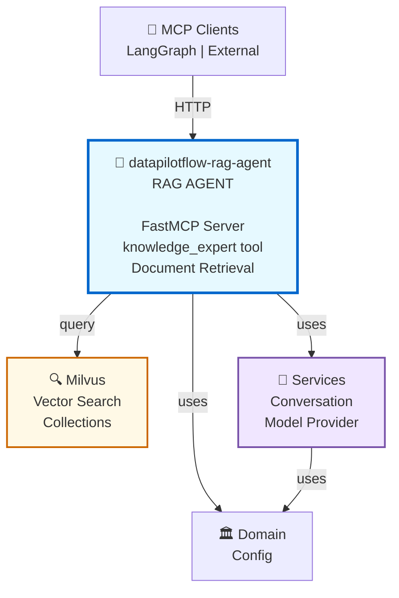

# DataPilotFlow RAG Agent

**RAG Agent Package - Retrieval-Augmented Generation Agent with MCP Server**

The `datapilotflow-rag-agent` package provides a Retrieval-Augmented Generation (RAG) agent that can retrieve relevant documents from knowledge bases and generate responses. It exposes the RAG agent as an MCP (Model Context Protocol) server for use by any MCP client.

## 📦 Package Overview

- **Version**: 1.0.0
- **Python**: >=3.11
- **Dependencies**: `datapilotflow-domain`, `datapilotflow-infrastructure`, `datapilotflow-services`
- **Purpose**: RAG agent implementation with MCP server exposure

## 🏗️ Architecture Position



**This package provides**:
- RAG agent implementation with LangGraph
- MCP server exposure (FastMCP)
- Knowledge retrieval from vector databases
- Document reranking and filtering
- Multi-query search strategies

## 📁 Package Structure

```
datapilotflow-rag-agent/
├── src/datapilotflow/rag_agent/
│   ├── __init__.py
│   │
│   ├── agent.py                 # RAGAgentService
│   ├── graph.py                 # LangGraph workflow
│   ├── state.py                 # RAG workflow state
│   ├── base_prompt.py           # Base prompts
│   │
│   ├── chains/                  # RAG chains
│   │   ├── multi_query_chain.py
│   │   ├── decomposition_chain.py
│   │   └── hyde_chain.py
│   │
│   ├── nodes/                   # Graph nodes
│   │   ├── document_retriever.py
│   │   ├── document_judger.py
│   │   ├── augmented_strategy_node.py
│   │   ├── multi_query_strategy_node.py
│   │   ├── decomposition_strategy_node.py
│   │   └── answer_generator.py
│   │
│   ├── tools/                    # Retrieval tools
│   │   ├── retriever_tool.py
│   │   └── retrieval_tools.py
│   │
│   ├── services/                 # RAG services
│   │   └── generate_response_rag.py
│   │
│   └── mcp/                      # MCP Server
│       ├── server.py            # FastMCP server
│       ├── adapters/
│       │   └── rag_adapter.py   # MCP to RAG adapter
│       └── tools/
│           └── rag_tools.py     # MCP tool definitions
│
├── run_rag_mcp_server.py        # MCP server entry point
├── DEPLOYMENT.md                 # Deployment guide
├── pyproject.toml
└── README.md
```

## 🔑 Key Components

### 1. RAG Agent (`agent.py`)

**RAGAgentService**: Main RAG agent service

**Responsibilities**:
- Document retrieval from knowledge base
- Document relevance judgment
- Document ranking by relevance
- Document filtering based on threshold

**Usage**:
```python
from datapilotflow.rag_agent.agent import RAGAgentService

agent = RAGAgentService(llm_client, rag_graph)

# Execute RAG pipeline
state = await agent.execute(agent_state)
```

### 2. RAG Graph (`graph.py`)

**LangGraph Workflow**: Orchestrates the RAG pipeline

**Pipeline Steps**:
1. **Document Retrieval**: Retrieve documents from vector DB
2. **Document Judging**: Judge document relevance
3. **Document Ranking**: Rank documents by relevance
4. **Document Filtering**: Filter by threshold
5. **Answer Generation** (optional): Generate answer from documents

**Usage**:
```python
from datapilotflow.rag_agent.graph import get_graph

# Get compiled graph
graph = get_graph()

# Invoke graph
result = await graph.ainvoke(rag_state)
```

### 3. MCP Server (`mcp/server.py`)

**FastMCP Server**: Exposes RAG agent as MCP server

**Tool**: `knowledge_expert`

**Features**:
- HTTP transport (streamable)
- Multi-query search
- Document reranking
- Structured document output

**Usage**:
```python
from datapilotflow.rag_agent.mcp.server import mcp

# Run MCP server
mcp.run(
    transport="http",
    host="0.0.0.0",
    port=65510
)
```

### 4. Retrieval Tools

**RetrieverTool**: Custom retriever using Milvus

**Features**:
- Collection-specific embedding configuration
- Multi-query search
- Reranking support
- Relevance filtering

## 🔗 How This Package Uses Lower Layers

### Uses Services
```python
from datapilotflow.services.conversation import ConversationHistoryService
from datapilotflow.services.model_provider import ModelProviderService

# RAG agent uses services
conversation_service = ConversationHistoryService()
model_service = ModelProviderService()
```

### Uses Infrastructure
```python
from datapilotflow.infrastructure.vectordb.milvus.client import MilvusClientWrapper

# RAG agent uses vector DB
vector_client = MilvusClientWrapper()
results = await vector_client.search(collection_name, query_vectors, top_k)
```

### Uses Domain
```python
from datapilotflow.domain.config import settings
from datapilotflow.domain.rag import KnowledgeChunk
from datapilotflow.domain.conversation import ConversationMessage

# RAG agent uses domain models
rag_top_k = settings.RAG_TOP_K
chunk = KnowledgeChunk(...)
```

## 🔗 How Other Packages Use This Package

### MCP Clients
```python
# External MCP clients connect to the MCP server
# HTTP endpoint: http://localhost:65510/mcp

# Tool call example:
{
    "tool": "knowledge_expert",
    "arguments": {
        "search_query": ["query1", "query2", ...],
        "collection_name": "my_collection",
        "top_k": 5,
        "enable_reranking": true
    }
}
```

### API Layer (Optional)
```python
from datapilotflow.rag_agent.services import get_response_stream_rag

# API can use RAG agent directly
async for chunk in get_response_stream_rag(
    query="What is RAG?",
    collection_name="knowledge_base",
    ...
):
    yield chunk
```

## 📦 Dependencies

### DataPilotFlow Dependencies
- `datapilotflow-domain>=1.0.0` - Domain models and configuration
- `datapilotflow-infrastructure>=1.0.0` - Vector DB client
- `datapilotflow-services>=1.0.0` - Conversation and model services

### External Dependencies
- `langgraph>=1.0.2` - Agent workflow orchestration
- `langchain-core>=1.0.0` - LangChain core
- `langchain-community>=0.0.1` - LangChain community
- `litellm>=1.79.0` - LLM provider abstraction
- `fastmcp>=0.4.0` - MCP server framework
- `opik>=1.9.11` - Observability
- `loguru>=0.7.3` - Logging
- `pydantic>=2.10.6` - Data validation
- `pydantic-settings>=2.0.0` - Settings management

## 🚀 Installation

```bash
uv pip install -e ../datapilotflow-domain \
  -e ../datapilotflow-infrastructure \
  -e ../datapilotflow-services \
  -e .
```

Or with pip:
```bash
cd datapilotflow-domain && pip install -e .
cd ../datapilotflow-infrastructure && pip install -e .
cd ../datapilotflow-services && pip install -e .
cd ../datapilotflow-rag-agent && pip install -e .
```


## 🧪 Testing

```bash
cd datapilotflow-rag-agent
pytest tests/
```

## 📚 Related Packages

**Depends on**:
- ✅ `datapilotflow-domain` - Uses config and domain models
- ✅ `datapilotflow-infrastructure` - Uses vector DB client
- ✅ `datapilotflow-services` - Uses conversation and model services

**Used by**:
- ✅ `datapilotflow-api` - Can use RAG agent (optional)
- ✅ External MCP clients - Connect to MCP server

## 🎯 Design Principles

1. **MCP Protocol**: Standard MCP server for interoperability
2. **LangGraph Workflow**: Modular, composable RAG pipeline
3. **Multi-Query Search**: Comprehensive document retrieval
4. **Reranking**: LLM-based document relevance ranking
5. **Service-Specific Logging**: Dedicated log file

## 🔧 Configuration

RAG agent uses configuration from `datapilotflow-domain`:

```python
from datapilotflow.domain.config import settings

# MCP Server Configuration
MCP_SERVER_HOST = settings.MCP_SERVER_HOST
MCP_SERVER_PORT = settings.MCP_SERVER_PORT
MCP_SERVER_NAME = settings.MCP_SERVER_NAME

# Vector Database (Required)
VECTOR_DB_HOST = settings.VECTOR_DB_HOST
VECTOR_DB_HTTP_PORT = settings.VECTOR_DB_HTTP_PORT

# MongoDB (Optional - for conversation history)
MONGO_HOST = settings.MONGO_HOST
MONGO_PORT = settings.MONGO_PORT
```

## 📋 Module Capabilities

### 1. **RAG Agent**
- Document retrieval from vector database
- Multi-query search strategies
- Document relevance judging
- Document reranking
- Context-aware response generation

### 2. **MCP Server**
- HTTP-based MCP server (FastMCP)
- `knowledge_expert` tool for document retrieval
- Streaming support
- Structured output formatting

### 3. **Retrieval Strategies**
- Multi-query expansion
- Decomposition-based search
- HyDE (Hypothetical Document Embeddings)
- Augmented retrieval strategies

## 🔄 RAG Pipeline Sequence

```
Client Query
    │
    ▼
RAG Agent (LangGraph)
    │
    ├→ Document Retriever (Milvus search)
    │       │
    │       ▼
    │  Retrieved Documents (top-k)
    │       │
    ├→ Document Judger (relevance eval)
    │       │
    │       ▼
    │  Ranked Documents
    │       │
    ├→ Filter by Threshold
    │       │
    └→ Answer Generator (optional)
            │
            ▼
    Structured Response
```

## 🛠️ How to Build & Start

### Build Steps

```bash
uv pip install -e ../datapilotflow-domain \
  -e ../datapilotflow-infrastructure \
  -e ../datapilotflow-services -e .
```

### Start MCP Server

```bash
python run_rag_mcp_server.py

# Server running at:
# HTTP: http://localhost:65510/mcp
```

### Monitor

```bash
tail -f logs/rag-agent.log
```

### Using RAG Agent

```python
from datapilotflow.rag_agent.graph import get_graph

graph = get_graph()
result = await graph.ainvoke(rag_state)
documents = result.get("retrieved_documents", [])
```

## 📖 Documentation

For more details:
- **Deployment Guide**: See [DEPLOYMENT.md](DEPLOYMENT.md)
- **MCP Server**: See [src/datapilotflow/rag_agent/mcp/server.py](src/datapilotflow/rag_agent/mcp/server.py)
- **RAG Graph**: See [src/datapilotflow/rag_agent/graph.py](src/datapilotflow/rag_agent/graph.py)
- **Retrieval Tools**: See [src/datapilotflow/rag_agent/tools/](src/datapilotflow/rag_agent/tools/)

