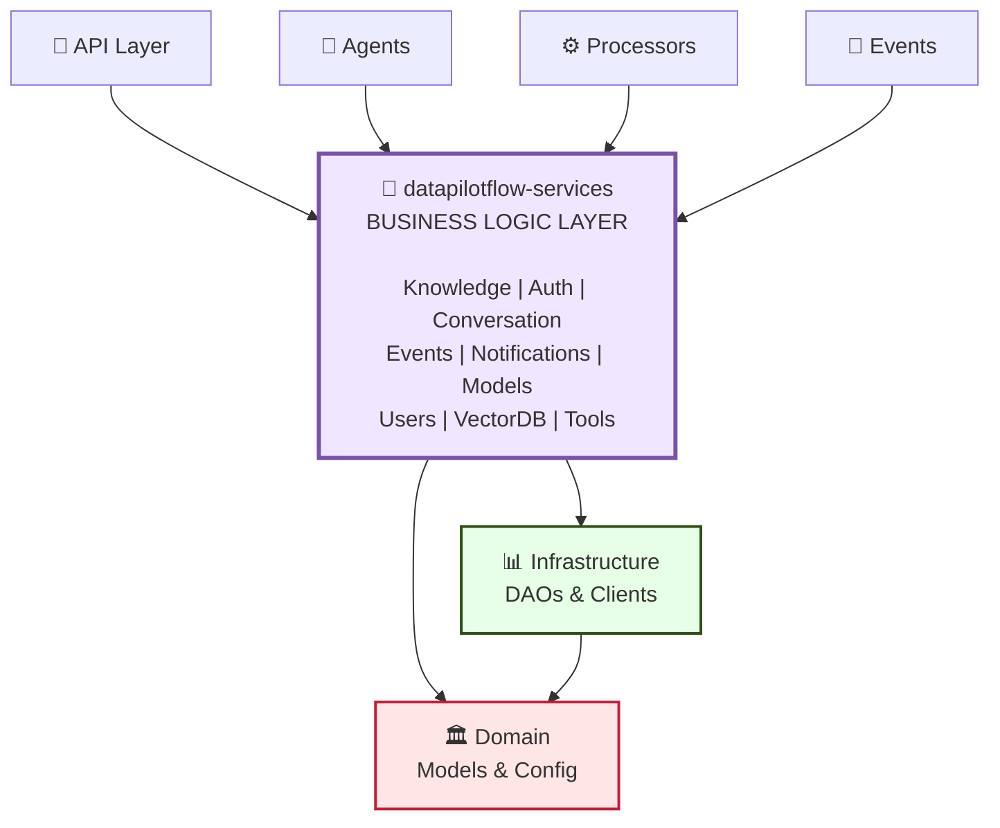

# DataPilotFlow Services

**Business Logic Layer - Service Orchestration and Business Rules**

The `datapilotflow-services` package provides business logic services that orchestrate data access and domain operations. It sits between the infrastructure layer (data access) and the application layers (API, agents, processors).

## 📦 Package Overview

- **Version**: 1.0.0
- **Python**: >=3.11
- **Dependencies**: `datapilotflow-domain`, `datapilotflow-infrastructure`
- **Purpose**: Business logic, service orchestration, and domain operations

## 🏗️ Architecture Position

### System Architecture Diagram



**This package provides**:
- Business logic services for all domains
- Service orchestration and coordination
- Event publishing
- WebSocket services
- Authentication and authorization services

## 📁 Package Structure

```
datapilotflow-services/
├── src/datapilotflow/services/
│   ├── __init__.py
│   │
│   ├── agent/                    # Agent services
│   │   └── agent_service.py
│   │
│   ├── auth/                     # Authentication & Authorization
│   │   ├── auth_service.py
│   │   └── admin_initialization_service.py
│   │
│   ├── conversation/             # Conversation management
│   │   └── conversation_history_service.py
│   │
│   ├── events_publisher/         # Event publishing
│   │   ├── base_event_publisher.py
│   │   ├── file_upload_event_publisher.py
│   │   ├── job_event_publisher.py
│   │   └── notification_event_publisher.py
│   │
│   ├── file_management/          # File upload services
│   │   └── file_upload_service.py
│   │
│   ├── knowledge/                 # Knowledge base services
│   │   ├── document_splitter_service.py
│   │   ├── job_timeline_service.py
│   │   ├── knowledge_ingestion_service.py
│   │   ├── knowledge_job_service.py
│   │   ├── knowledge_source_service.py
│   │   ├── llm_content_filter_service.py
│   │   └── vectordb_collection_service.py
│   │
│   ├── model_provider/            # Model provider services
│   │   ├── model_provider_service.py
│   │   └── model_provider_initialization_service.py
│   │
│   ├── notification/              # Notification services
│   │   ├── job_notification_helper.py
│   │   ├── notification_event_service.py
│   │   ├── notification_listener_service.py
│   │   └── notification_websocket_service.py
│   │
│   ├── tool/                      # Tool & MCP services
│   │   ├── mcp_server_service.py
│   │   └── tool_service.py
│   │
│   ├── users/                     # User management
│   │   ├── roles_service.py
│   │   └── user_service.py
│   │
│   ├── vectordb/                  # Vector database services
│   │   └── collection_service.py
│   │
│   ├── websocket/                 # WebSocket utilities
│   │
│   └── opik_utils.py              # Observability utilities
│
├── tests/
├── pyproject.toml
└── README.md
```

## 🔑 Key Components

### 1. Knowledge Services

**KnowledgeJobService**: Manages knowledge ingestion jobs
```python
from datapilotflow.services.knowledge import KnowledgeJobService

service = KnowledgeJobService()

# Create and start a knowledge job
job = await service.create_job(
    name="My Knowledge Job",
    source_id="source_123",
    config={...}
)

# Get job status
job = await service.get_job_by_id(job_id)

# Update job
await service.update_job(job_id, {"status": "completed"})
```

**KnowledgeSourceService**: Manages knowledge sources
```python
from datapilotflow.services.knowledge import KnowledgeSourceService

service = KnowledgeSourceService()

# Create source
source = await service.create_source(
    name="My Source",
    url="https://example.com",
    scraping_mode="full"
)

# Get all sources
sources = await service.get_all_sources()
```

**KnowledgeIngestionService**: Orchestrates the ingestion pipeline
```python
from datapilotflow.services.knowledge import KnowledgeIngestionService

service = KnowledgeIngestionService()

# Process knowledge ingestion
await service.ingest_knowledge(
    job_id=job_id,
    source_id=source_id,
    config={...}
)
```

### 2. Authentication Services

**AuthService**: User authentication and JWT management
```python
from datapilotflow.services.auth import AuthService

service = AuthService()

# Authenticate user
user, token = await service.authenticate(email, password)

# Verify token
user = await service.verify_token(token)

# Create user
user = await service.create_user(email, password, username)
```

**AdminInitializationService**: Initializes admin user
```python
from datapilotflow.services.auth import AdminInitializationService

service = AdminInitializationService()

# Initialize admin (if not exists)
await service.initialize_admin()
```

### 3. Conversation Services

**ConversationHistoryService**: Manages conversation history
```python
from datapilotflow.services.conversation import ConversationHistoryService

service = ConversationHistoryService()

# Add message to conversation
await service.add_message(
    conversation_id=conv_id,
    user_id=user_id,
    message="Hello",
    role="user"
)

# Get conversation history
messages = await service.get_conversation_history(conv_id)
```

### 4. Event Publishers

**JobEventPublisher**: Publishes knowledge job events
```python
from datapilotflow.services.events_publisher import JobEventPublisher

publisher = JobEventPublisher()

# Publish job created event
await publisher.publish_job_created(job_id, job_data)

# Publish job status update
await publisher.publish_job_status_updated(job_id, "completed")
```

**FileUploadEventPublisher**: Publishes file upload events
```python
from datapilotflow.services.events_publisher import FileUploadEventPublisher

publisher = FileUploadEventPublisher()

# Publish file uploaded event
await publisher.publish_file_uploaded(file_id, file_data)
```

### 5. Notification Services

**NotificationWebSocketService**: WebSocket notifications
```python
from datapilotflow.services.notification import NotificationWebSocketService

service = NotificationWebSocketService()

# Send notification via WebSocket
await service.send_notification(
    user_id=user_id,
    notification={
        "type": "job_completed",
        "message": "Your job is complete"
    }
)
```

### 6. Model Provider Services

**ModelProviderService**: Manages LLM and embedding providers
```python
from datapilotflow.services.model_provider import ModelProviderService

service = ModelProviderService()

# Get provider
provider = await service.get_provider(provider_id)

# List all providers
providers = await service.get_all_providers()

# Create provider
provider = await service.create_provider(
    name="OpenAI",
    provider_type="llm",
    config={...}
)
```

## 🔗 How This Package Uses Lower Layers

### Uses Infrastructure (DAOs and Clients)
```python
from datapilotflow.infrastructure.dao.knowledge import KnowledgeJobDAO
from datapilotflow.infrastructure.vectordb.milvus.client import MilvusClientWrapper
from datapilotflow.infrastructure.mq.client import RabbitMQClient

# Services use DAOs for data access
class KnowledgeJobService:
    def __init__(self):
        self.job_dao = KnowledgeJobDAO()
        self.vector_client = MilvusClientWrapper()
        self.mq_client = RabbitMQClient()
```

### Uses Domain (Models and Config)
```python
from datapilotflow.domain.knowledge import KnowledgeJob, KnowledgeSource
from datapilotflow.domain.config import settings
from datapilotflow.domain.events import JobCreatedEvent

# Services work with domain models
job = KnowledgeJob(name="My Job", ...)
await self.job_dao.create(job)

# Use domain config
rag_top_k = settings.RAG_TOP_K
```

## 🔗 How Other Packages Use This Package

### API Layer
```python
from datapilotflow.services.knowledge import KnowledgeJobService
from datapilotflow.services.auth import AuthService

# API routes use services
@router.post("/knowledge/jobs")
async def create_job(job_data: JobCreateRequest):
    service = KnowledgeJobService()
    job = await service.create_job(**job_data.dict())
    return job
```

### Agents
```python
from datapilotflow.services.conversation import ConversationHistoryService
from datapilotflow.services.model_provider import ModelProviderService

# Agents use services for conversation and model access
conversation_service = ConversationHistoryService()
model_service = ModelProviderService()
```

### Processors
```python
from datapilotflow.services.knowledge import KnowledgeIngestionService

# Processors use services for orchestration
ingestion_service = KnowledgeIngestionService()
await ingestion_service.ingest_knowledge(job_id, source_id, config)
```

### Events
```python
from datapilotflow.services.events_publisher import JobEventPublisher

# Event listeners use services to publish events
publisher = JobEventPublisher()
await publisher.publish_job_status_updated(job_id, "completed")
```

## 📦 Dependencies

### DataPilotFlow Dependencies
- `datapilotflow-domain>=1.0.0` - Domain models and configuration
- `datapilotflow-infrastructure>=1.0.0` - DAOs and database clients

### External Dependencies
- `langchain-core>=1.0.0` - LangChain integration
- `litellm>=1.79.0` - LLM provider abstraction
- `PyJWT>=2.10.0` - JWT token handling
- `passlib>=1.7.4` - Password hashing
- `bcrypt>=4.0.1,<4.1.0` - Password encryption
- `python-multipart>=0.0.20` - Multipart form handling
- `opik>=1.9.11` - Observability
- `loguru>=0.7.3` - Logging
- `pydantic>=2.10.6` - Data validation

## 📋 Module Capabilities

### 1. **Knowledge Services**
- Knowledge job orchestration (create, update, retrieve, delete)
- Knowledge source management
- Knowledge ingestion pipeline coordination
- Document splitter configuration
- Job timeline tracking
- LLM content filtering

### 2. **Authentication & Authorization**
- User authentication (login, signup, verification)
- JWT token generation and validation
- Admin user initialization
- Role-based access control
- Password hashing and security

### 3. **Conversation Management**
- Conversation history storage
- Message persistence
- Conversation retrieval by ID
- Multi-user conversation support

### 4. **Event Publishing**
- Job lifecycle event publishing (Created, Started, Updated, Completed, Failed)
- File upload event publishing
- Notification event publishing
- RabbitMQ message routing

### 5. **Notification Services**
- Notification creation and persistence
- WebSocket-based real-time notifications
- Notification event listeners
- Job notification helpers

### 6. **Model Provider Services**
- LLM provider management (OpenAI, Anthropic, etc.)
- Embedding model provider management
- Provider configuration and validation

## 🔄 Service Interaction Sequence Diagram

```
┌──────────────────┐
│   API Request    │
└────────┬─────────┘
         │
         ▼
┌────────────────────────────────────────┐
│  API Router (e.g., knowledge_router)   │
└────────┬───────────────────────────────┘
         │ calls
         ▼
┌────────────────────────────────────────┐
│  Service Layer                         │
│  (e.g., KnowledgeJobService)           │
│  ┌──────────────────────────────────┐  │
│  │ • Validate input                 │  │
│  │ • Orchestrate DAOs               │  │
│  │ • Apply business rules           │  │
│  │ • Publish events                 │  │
│  └──────────────────────────────────┘  │
└────────┬───────────────────────────────┘
         │ uses
         ├─────────────────────┬──────────────────┐
         ▼                     ▼                  ▼
    ┌─────────────┐    ┌──────────────┐    ┌────────────┐
    │ Knowledge   │    │  Event       │    │  Mongo     │
    │ Job DAO     │    │  Publisher   │    │  Client    │
    └─────────────┘    └──────────────┘    └────────────┘
         │                  │                    │
         │                  ▼                    ▼
         │            ┌──────────────┐    ┌────────────────┐
         │            │  RabbitMQ    │    │   MongoDB      │
         │            │  Message Bus │    │   Database     │
         │            └──────────────┘    └────────────────┘
         │                                      │
         └──────────────────────────────────────┘

         Returns to API Router → HTTP Response
```

## 🚀 Installation

### Prerequisites
- Python >=3.11
- datapilotflow-domain installed
- datapilotflow-infrastructure installed
- MongoDB, Milvus, RabbitMQ running (for full functionality)

### Install from Source

```bash
uv pip install -e ../datapilotflow-domain \
  -e ../datapilotflow-infrastructure \
  -e .
```

Or with pip:
```bash
cd datapilotflow-domain && pip install -e .
cd ../datapilotflow-infrastructure && pip install -e .
cd ../datapilotflow-services && pip install -e .
```

### Verify Installation

```bash
python -c "
from datapilotflow.services.knowledge import KnowledgeJobService
from datapilotflow.services.auth import AuthService
print('✓ Knowledge service imported')
print('✓ Auth service imported')
"
```


## 🧪 Testing

```bash
cd datapilotflow-services
pytest tests/
```

## 📚 Related Packages

**Depends on**:
- ✅ `datapilotflow-domain` - Uses domain models and config
- ✅ `datapilotflow-infrastructure` - Uses DAOs and clients

**Used by**:
- ✅ `datapilotflow-api` - Uses all services
- ✅ `datapilotflow-processors` - Uses knowledge services
- ✅ `datapilotflow-events` - Uses event publishers
- ✅ `datapilotflow-rag-agent` - Uses conversation and model services
- ✅ `datapilotflow-assistant-agent` - Uses services

## 🎯 Design Principles

1. **Service Layer Pattern**: Encapsulates business logic
2. **Orchestration**: Coordinates between multiple DAOs and clients
3. **Domain Model Usage**: Works with domain models
4. **Event-Driven**: Publishes events for async processing
5. **Async/Await**: All operations are async

## 🔧 Service Responsibilities

Each service is responsible for:
- **Business Logic**: Domain-specific operations
- **Orchestration**: Coordinating multiple data access operations
- **Validation**: Business rule validation
- **Event Publishing**: Publishing domain events
- **Error Handling**: Service-level error handling

## 🛠️ How to Build & Start

### Build Steps

1. **Install dependencies in order**
   ```bash
   cd ../datapilotflow-domain && pip install -e .
   cd ../datapilotflow-infrastructure && pip install -e .
   cd ../datapilotflow-services && pip install -e .
   ```

2. **Configure environment**
   ```bash
   cat > .env << EOF
   MONGO_CONN_STR=mongodb://localhost:27017
   MONGO_DB_NAME=datapilotflow
   JWT_SECRET_KEY=your-secret-key-here
   VECTOR_DB_HOST=localhost
   VECTOR_DB_HTTP_PORT=19530
   RABBITMQ_HOST=localhost
   EOF
   ```

3. **Verify installation**
   ```bash
   python -m pytest tests/ -v
   ```

### Development Setup

```bash
# Create development environment
python -m venv venv
source venv/bin/activate

# Install with dev dependencies
pip install -e ".[dev]"

# Run tests
pytest tests/ -v

# Run type checking
pyright .
```

### Using Services in Your Application

```python
import asyncio
from datapilotflow.services.knowledge import KnowledgeJobService
from datapilotflow.services.auth import AuthService

async def main():
    # Initialize services
    job_service = KnowledgeJobService()
    auth_service = AuthService()

    # Create a knowledge job
    job = await job_service.create_job(
        name="My Job",
        source_id="source_123",
        config={"chunk_size": 1000}
    )
    print(f"Created job: {job.id}")

asyncio.run(main())
```

## 📖 Documentation

For more details on specific components:
- **Knowledge Services**: See [src/datapilotflow/services/knowledge/](src/datapilotflow/services/knowledge/)
- **Auth Services**: See [src/datapilotflow/services/auth/](src/datapilotflow/services/auth/)
- **Event Publishers**: See [src/datapilotflow/services/events_publisher/](src/datapilotflow/services/events_publisher/)
- **Notification Services**: See [src/datapilotflow/services/notification/](src/datapilotflow/services/notification/)

