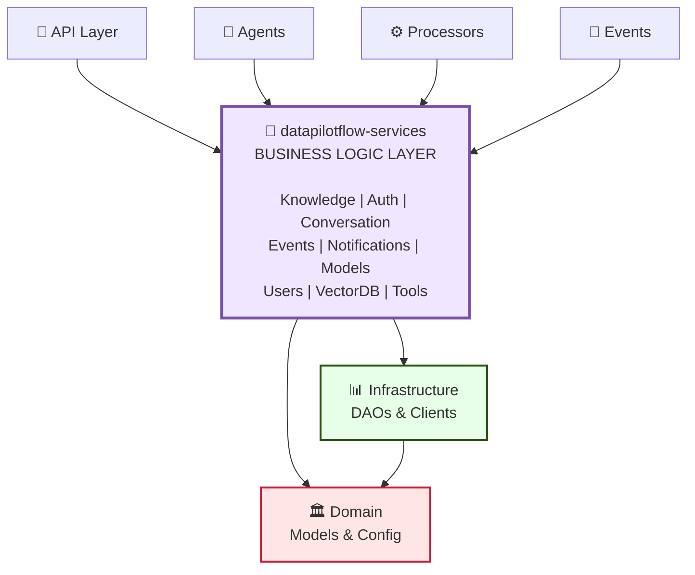

# DataPilotFlow Services

**Business Logic Layer - Service Orchestration and Business Rules**

The `datapilotflow-services` package provides business logic services that orchestrate data access and domain operations. It sits between the infrastructure layer (data access) and the application layers (API, agents, processors).

## 🏗️ Architecture Position

### System Architecture Diagram



**This package provides**:
- Business logic services for all domains
- Service orchestration and coordination
- Event publishing
- WebSocket services
- Authentication and authorization services

## 🔑 Key Components

### 1. Knowledge Services

**KnowledgeJobService**: Manages knowledge ingestion jobs
```python
from datapilotflow.services.knowledge import KnowledgeJobService

service = KnowledgeJobService()

# Create and start a knowledge job
job = await service.create_job(
    name="My Knowledge Job",
    source_id="source_123",
    config={...}
)

# Get job status
job = await service.get_job_by_id(job_id)

# Update job
await service.update_job(job_id, {"status": "completed"})
```

**KnowledgeSourceService**: Manages knowledge sources
```python
from datapilotflow.services.knowledge import KnowledgeSourceService

service = KnowledgeSourceService()

# Create source
source = await service.create_source(
    name="My Source",
    url="https://example.com",
    scraping_mode="full"
)

# Get all sources
sources = await service.get_all_sources()
```

**KnowledgeIngestionService**: Orchestrates the ingestion pipeline
```python
from datapilotflow.services.knowledge import KnowledgeIngestionService

service = KnowledgeIngestionService()

# Process knowledge ingestion
await service.ingest_knowledge(
    job_id=job_id,
    source_id=source_id,
    config={...}
)
```

### 2. Authentication Services

**AuthService**: User authentication and JWT management
```python
from datapilotflow.services.auth import AuthService

service = AuthService()

# Authenticate user
user, token = await service.authenticate(email, password)

# Verify token
user = await service.verify_token(token)

# Create user
user = await service.create_user(email, password, username)
```

**AdminInitializationService**: Initializes admin user
```python
from datapilotflow.services.auth import AdminInitializationService

service = AdminInitializationService()

# Initialize admin (if not exists)
await service.initialize_admin()
```

### 3. Conversation Services

**ConversationHistoryService**: Manages conversation history
```python
from datapilotflow.services.conversation import ConversationHistoryService

service = ConversationHistoryService()

# Add message to conversation
await service.add_message(
    conversation_id=conv_id,
    user_id=user_id,
    message="Hello",
    role="user"
)

# Get conversation history
messages = await service.get_conversation_history(conv_id)
```

### 4. Event Publishers

**JobEventPublisher**: Publishes knowledge job events
```python
from datapilotflow.services.events_publisher import JobEventPublisher

publisher = JobEventPublisher()

# Publish job created event
await publisher.publish_job_created(job_id, job_data)

# Publish job status update
await publisher.publish_job_status_updated(job_id, "completed")
```

**FileUploadEventPublisher**: Publishes file upload events
```python
from datapilotflow.services.events_publisher import FileUploadEventPublisher

publisher = FileUploadEventPublisher()

# Publish file uploaded event
await publisher.publish_file_uploaded(file_id, file_data)
```

### 5. Notification Services

**NotificationWebSocketService**: WebSocket notifications
```python
from datapilotflow.services.notification import NotificationWebSocketService

service = NotificationWebSocketService()

# Send notification via WebSocket
await service.send_notification(
    user_id=user_id,
    notification={
        "type": "job_completed",
        "message": "Your job is complete"
    }
)
```

### 6. Model Provider Services

**ModelProviderService**: Manages LLM and embedding providers
```python
from datapilotflow.services.model_provider import ModelProviderService

service = ModelProviderService()

# Get provider
provider = await service.get_provider(provider_id)

# List all providers
providers = await service.get_all_providers()

# Create provider
provider = await service.create_provider(
    name="OpenAI",
    provider_type="llm",
    config={...}
)
```

## 📋 Module Capabilities

### 1. **Knowledge Services**
- Knowledge job orchestration (create, update, retrieve, delete)
- Knowledge source management
- Knowledge ingestion pipeline coordination
- Document splitter configuration
- Job timeline tracking
- LLM content filtering

### 2. **Authentication & Authorization**
- User authentication (login, signup, verification)
- JWT token generation and validation
- Admin user initialization
- Role-based access control
- Password hashing and security

### 3. **Conversation Management**
- Conversation history storage
- Message persistence
- Conversation retrieval by ID
- Multi-user conversation support

### 4. **Event Publishing**
- Job lifecycle event publishing (Created, Started, Updated, Completed, Failed)
- File upload event publishing
- Notification event publishing
- RabbitMQ message routing

### 5. **Notification Services**
- Notification creation and persistence
- WebSocket-based real-time notifications
- Notification event listeners
- Job notification helpers

### 6. **Model Provider Services**
- LLM provider management (OpenAI, Anthropic, etc.)
- Embedding model provider management
- Provider configuration and validation

## 🔄 Service Interaction Sequence Diagram

```
┌──────────────────┐
│   API Request    │
└────────┬─────────┘
         │
         ▼
┌────────────────────────────────────────┐
│  API Router (e.g., knowledge_router)   │
└────────┬───────────────────────────────┘
         │ calls
         ▼
┌────────────────────────────────────────┐
│  Service Layer                         │
│  (e.g., KnowledgeJobService)           │
│  ┌──────────────────────────────────┐  │
│  │ • Validate input                 │  │
│  │ • Orchestrate DAOs               │  │
│  │ • Apply business rules           │  │
│  │ • Publish events                 │  │
│  └──────────────────────────────────┘  │
└────────┬───────────────────────────────┘
         │ uses
         ├─────────────────────┬──────────────────┐
         ▼                     ▼                  ▼
    ┌─────────────┐    ┌──────────────┐    ┌────────────┐
    │ Knowledge   │    │  Event       │    │  Mongo     │
    │ Job DAO     │    │  Publisher   │    │  Client    │
    └─────────────┘    └──────────────┘    └────────────┘
         │                  │                    │
         │                  ▼                    ▼
         │            ┌──────────────┐    ┌────────────────┐
         │            │  RabbitMQ    │    │   MongoDB      │
         │            │  Message Bus │    │   Database     │
         │            └──────────────┘    └────────────────┘
         │                                      │
         └──────────────────────────────────────┘

         Returns to API Router → HTTP Response
```

## 🚀 Installation

### Prerequisites
- Python >=3.11
- datapilotflow-domain installed
- datapilotflow-infrastructure installed
- MongoDB, Milvus, RabbitMQ running (for full functionality)

### Install from Source

```bash
uv pip install -e ../datapilotflow-domain \
  -e ../datapilotflow-infrastructure \
  -e .
```

Or with pip:
```bash
cd datapilotflow-domain && pip install -e .
cd ../datapilotflow-infrastructure && pip install -e .
cd ../datapilotflow-services && pip install -e .
```

### Verify Installation

```bash
python -c "
from datapilotflow.services.knowledge import KnowledgeJobService
from datapilotflow.services.auth import AuthService
print('✓ Knowledge service imported')
print('✓ Auth service imported')
"
```


## 🧪 Testing

```bash
cd datapilotflow-services
pytest tests/
```
